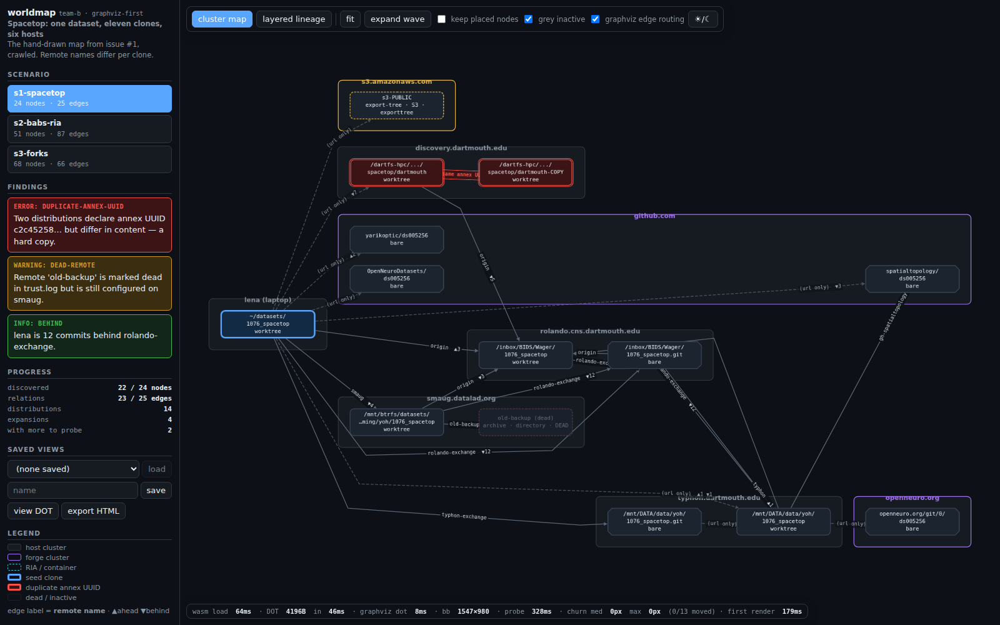
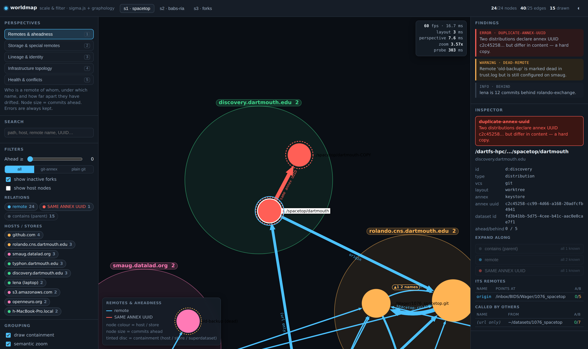
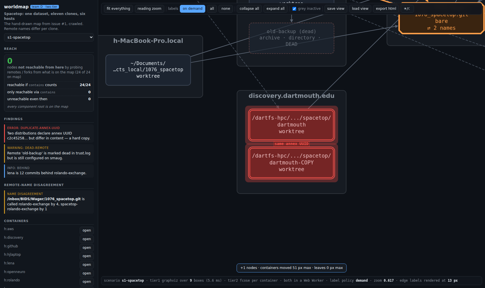
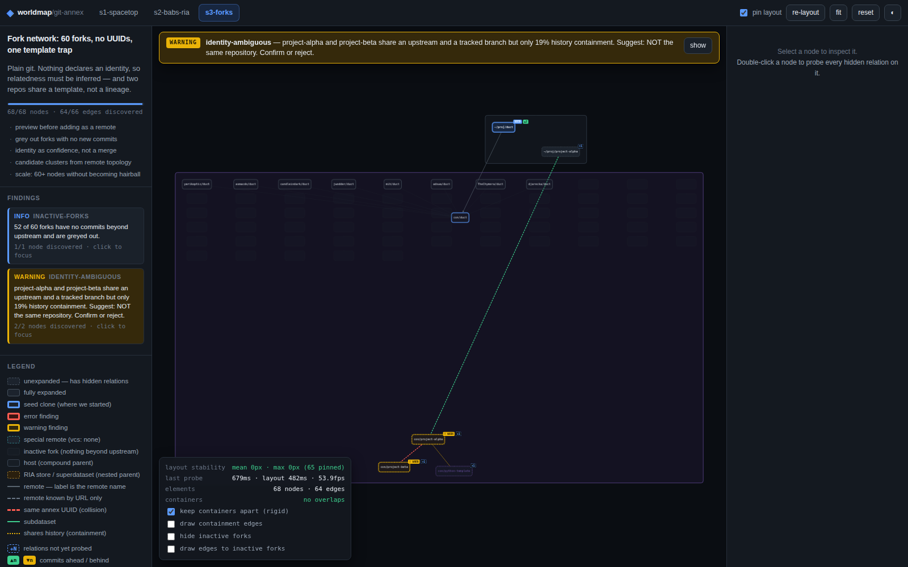
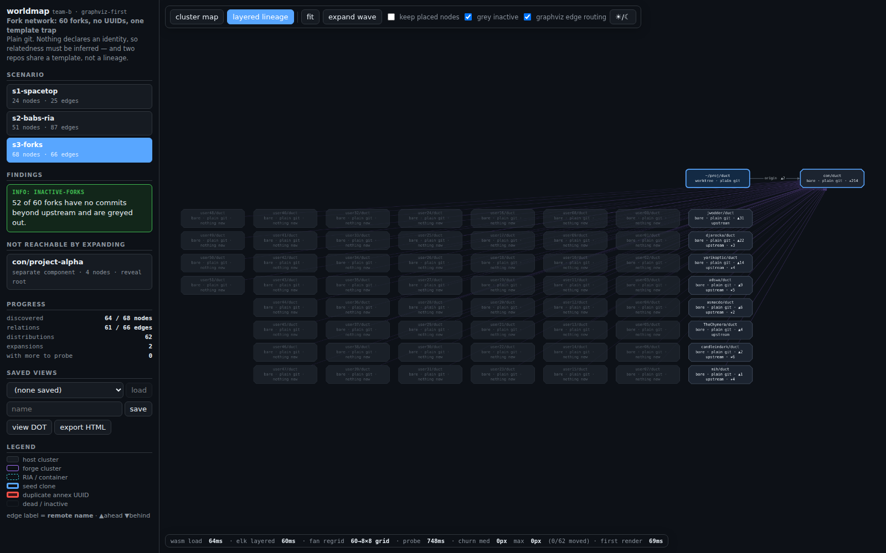
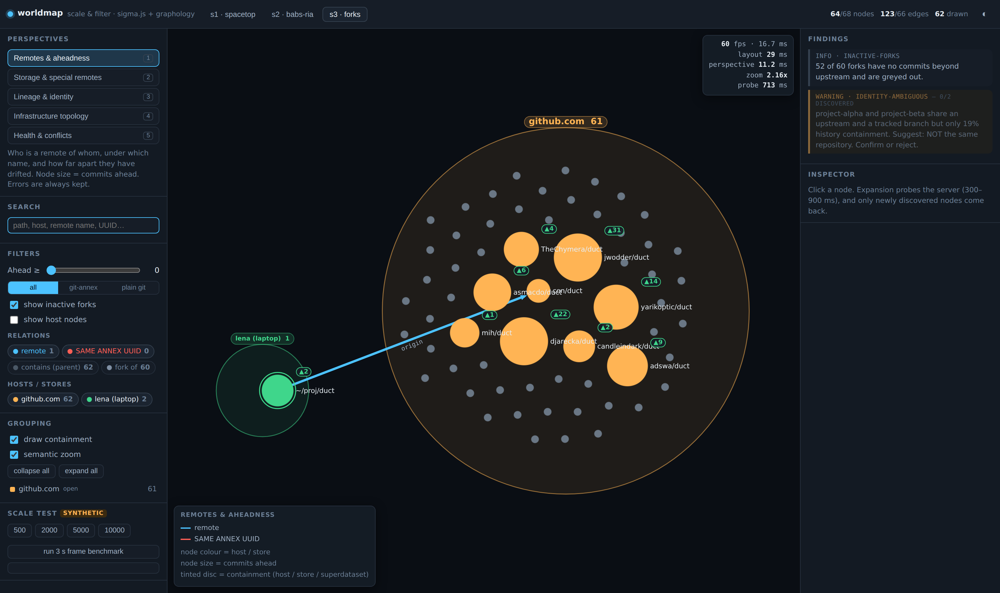
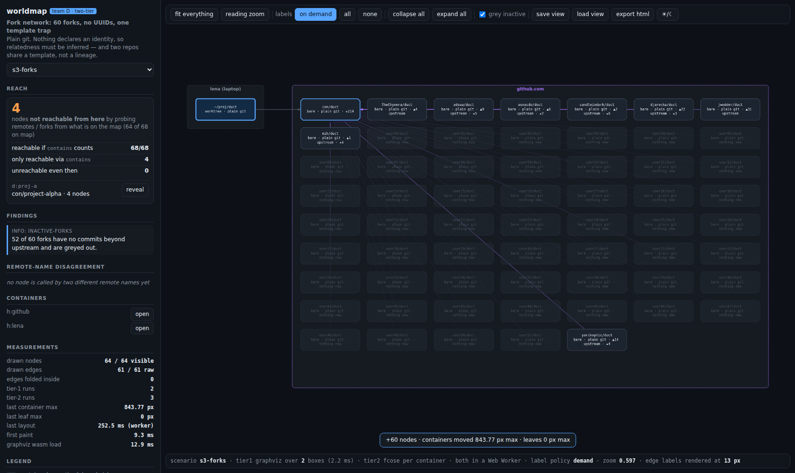
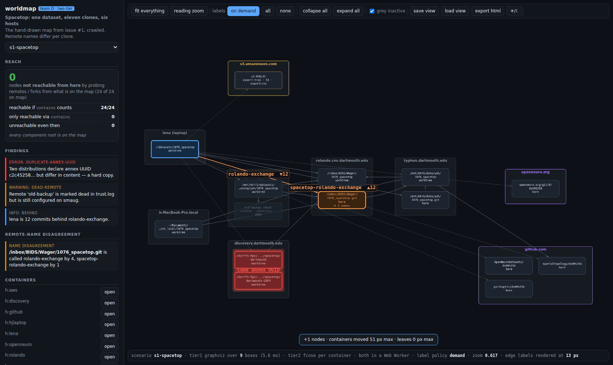

# Bake-off results: three approaches to exploring the git worldmap

Three teams built working MVPs against the same three
[scenarios](../scenarios/README.md), each acting as backend engineer →
frontend designer → UX expert driving the running app with Playwright.
Every claim below was **re-verified against the committed artefacts**, not
taken from the teams' own summaries.

| | **Team A** | **Team B** | **Team C** |
| --- | --- | --- | --- |
| Approach | Compound & Correct | Graphviz-first | Scale & Filter |
| Stack | Cytoscape 3.34 + fCoSE + layout-utilities | @hpcc-js/wasm Graphviz → Cytoscape `preset` + ELK | sigma 3.0.3 + graphology |
| Client LOC | ~2 500 | ~2 700 | 1 862 |
| Screenshots | 16 | 25 | 38 |
| All non-blank? | yes | yes | yes |
| First paint | 311 ms cold | 985 ms cold | 526 ms cold |
| Persistence | **none** | **0 px drift on reload** | **none** |
| Self-contained export | no | **3 files, 0 external refs, verified over `file://`** | no |

## Side by side: the same moment, four ways

### s1 — the duplicate annex UUID, the shared correctness benchmark

Every team had to make this loud. All four did, differently.

**Team A** — compound host box, red halo, `! ERROR` badges, and a live
layout-stability HUD reading `mean 0px · max 0px (15 pinned)`.

**Team B** — Graphviz cluster geometry; the error inside a `cluster_discovery`
box laid out by `dot`.

**Team C** — no compound nodes: containment is a tinted disc behind the nodes,
with the finding echoed in a right-hand inspector.

**Team D** — containers as ordinary nodes with explicit geometry, which is what
made them pinnable.

### s3 — 52 inactive forks, the scale-and-legibility benchmark

**Team A** — pinned layout; note the container-sized hole filtering leaves behind.

**Team B** — the layered lineage view, and the best rendering of this scenario in
round 1: forks on an 8×8 grid, active ones separated, and a
*NOT REACHABLE BY EXPANDING* panel.

**Team C** — greying plus filters; hiding inactive forks drops drawn nodes 66 → 10.

**Team D** — greyed forks with the reach panel quantifying what the seed cannot see.

### The one thing no team in round 1 could do

Issue #1 exists because the same repository is `rolando-exchange` to four clones
and `spacetop-rolando-exchange` to a fifth. Round 1 could only tell you that
through an inspector. Team D renders it **at fit zoom, nothing selected, no
inspector open** — 13 px labels, a `⚠ 2 names` node badge, and a sidebar panel
naming the disagreement:

And the affordance that stops a disconnected component from vanishing silently —
the failure all three round-1 teams hit:

## Verification performed

* Every one of the **79 screenshots** was analysed for blankness (distinct
  colour count and dominant-colour share). **Zero suspect** across all three
  teams — nobody shipped an empty canvas or an error overlay.
* Team A's headline claim was checked against its raw `last-metrics.json`
  rather than its prose. It holds *exactly*: `leaf.max = 0.00 px` on all 19
  pinned probes, against 434–756 px for the unpinned control. Its aggregate
  s2 mean of 326.82 px is entirely the new container, which it reported
  separately — no overclaim.
* Team B's instability was reproduced independently: `diff` of two
  consecutive saved views gives **88 changed lines of 155** for a single
  expansion, with coordinates churning outright (`y: 716 → 381`).
* Team B's exports were checked for external references: **0** in all three,
  464–496 kB.

## The result nobody expected: all three failed at the same two places

This is the real output of the exercise. Two failures appeared in **all
three** prototypes, independently, with different renderers and different
layout engines — which makes them properties of *the problem and our model*,
not of anybody's stack choice.

### 1. Edge labels do not survive the default view

Issue #1 exists because the same peer is `origin` from one clone and
`rolando-exchange` from another. **No team could show that in the picture.**

* Team A measured it: at the fit zoom their own app chooses (0.570 on s1,
  0.475 on s3), 9 px labels render at **5.1 / 4.3 px** — below legibility.
  The remote-name story is carried by the inspector panel instead.
* Team C hit it from the other side: canvas labels collide at **51 nodes**,
  visibly overlapping in `s2-04` (`containers (subdataset)` over
  `inputs/data (subdataset)`, and `origin x40` drawn doubled).
* Team B avoided it only by abandoning free layout for a rigid grid.

**Consequence for the design:** the per-clone remote name cannot be an edge
label in the default view. It needs to be a hover/inspector affordance, a
zoom-gated detail, or the edge must be drawn *as* the naming relation
(label-on-demand). This should go into the `graph:` annotation proposal —
`graph:edgeLabel` needs a companion `graph:edgeLabelZoom`.

### 2. Expansion from a seed silently omits whole components

**s3 is two disconnected components.** The `identity-ambiguous` finding —
the template trap, the single most interesting thing in that fixture — is
unreachable by expanding from the seed.

* Team B's first run *silently reported 67/68 nodes and the finding never
  fired*. They added `/api/roots` and a "Not reachable by expanding" panel.
* Team A hit the same wall and invented a synthetic `host_scan` relation to
  reach it.
* Team C sidestepped it by synthesising a `contains` relation from `parent`,
  noting that without it "a quarter of s3 is unreachable from the seed".

**Consequence for the design:** a seed is not a substitute for a root set.
The store must expose *roots*, the UI must show "N nodes not reachable from
here", and `contains`/`parent` must be a first-class walkable relation rather
than a rendering hint. This is a finding about the model in
[repo-embedded-things-and-collections.md](../repo-embedded-things-and-collections.md),
not about any renderer.

## Where the three approaches actually differ

### Team A — compound nodes and stable layout do not compose

The decisive finding of the bake-off. fCoSE pins leaves perfectly
(0.00 px) but **cannot pin a compound**: `d:ria` moved **980 px** the moment
it gained 40 children, while every leaf around it stayed at 0.00. In a
compound-first design, containers are exactly what grows.

So the recommendation in
[tech-graph-visualization-stack.md](../tech-graph-visualization-stack.md) —
"Cytoscape + fCoSE with `fixedNodeConstraint`" — is right about the pieces
and wrong about the composition. The gap is real and it is the library's,
not a misconfiguration.

Also found: revealing 68 nodes at once → **6.2 fps, 417 ms blocked frame**;
a rigid container separator that fixes overlap but slides a whole host
**299 px** when one node is added; and four concrete stack bugs, including
`cy.style(arr)` on a populated graph silently dropping every edge rule.

### Team B — right about persistence, wrong about exploration

Graphviz is **never the bottleneck** (7/13/17–24 ms), first paint is fine,
and persistence is the best of the three: 0 px drift on reload, and the only
working self-contained export — the artefact most likely to get the tool
adopted, since issue #1 exists because someone pasted a hand-drawn diagram
into an issue.

But whole-graph re-layout on every expansion is fatal to the core UX:
**one added node moved 62 of 62 placed nodes by a median 1588 px**, and
crucially the churn is *bimodal* — about half of expansions were 0 px, the
rest catastrophic. Unpredictable churn is worse than consistently mediocre
churn, because the user cannot build a mental model.

It also needed three hacks to make `dot` handle fans, and its spline routing
replays for **23 edges in s1 and 0 in s2/s3**, because compound and
grid-snapped nodes invalidate the waypoints.

Correction they contributed: `dot_json` in `@hpcc-js/wasm` 2.35.0 returns the
**parsed DOT AST with no coordinates**; the format carrying layout results is
plain `json` (xdot). The research doc's "cheapest start" recipe was wrong on
this detail and is now fixed in practice.

### Team C — the compound-node question was never the binding constraint

Sigma's missing compound nodes were **survivable at every size tested up to
10 000**, three orders of magnitude past the fixtures. But it cost roughly
**600 of 1 862 client lines to replace one library feature**, and produced a
coordinate-space bug found only by driving the app.

Their sharpest finding reframes something the research treated as settled:
**collapse stops paying above ~500 nodes for sparse groups.** Collapsing 31
synthetic hosts cut drawn nodes 468 → 32 but pushed edges 773 → **1 205**
and made frames *slower*, because every cross-group pair remains an edge.
And the 10 000-node hairball is **edge aggregation, not node nesting** —
compound nodes would have produced the identical mess.

Caveat on all their FPS numbers, which they flagged themselves: WebGL here is
**SwiftShader (software)**; the same 51-node scene costs 22.5 ms at DPR 1 and
107.9 ms at DPR 2, with ±40 % run-to-run variance. Treat them as ordering,
not magnitude.

## Judgement

**Take Cytoscape (Team A) as the base**, for the reasons the research gave —
compound nodes, multi-edges, edge labels, headless export — none of which the
bake-off overturned. Then fix the two things it got wrong:

1. **Do not let containers be laid out incrementally.** Give compounds their
   geometry from a whole-graph pass (Team B's Graphviz path is the natural
   source) and let fCoSE place only leaves inside fixed container bounds.
   This is a hybrid neither team built and it directly targets the 980 px
   compound jump.
2. **Adopt Team B's persistence and export wholesale.** Team A has none;
   Team B's is verified. The self-contained export is the single most
   adoption-relevant artefact produced.
3. **Adopt Team C's aggregate/collapse tier and perspectives**, but treat
   collapse as edge aggregation rather than node hiding, per their own
   finding.
4. **Move layout off the main thread** before anything else performance-
   related. All three hit main-thread layout as their scaling wall.

**What none of them built and what I would build first:** persistence in the
Cytoscape line, and a root set. The bake-off proved the renderer question is
less load-bearing than the research assumed — all three rendered the fixtures
acceptably — while the *model* questions (roots, walkable containment,
label-on-demand) broke all three identically.

## Caveats

Nothing was tested above 68 real nodes; every scale claim beyond that is
extrapolation from synthetic data and is labelled as such by the teams.
Rendering was on software WebGL throughout. The fixtures are synthetic,
structurally faithful but not crawled from real hosts.

---

# Round 2: Team D — the hybrid, built and measured

A fourth team implemented the judgement above. Every number below was
re-verified against `team-d/tools/last-metrics.json` and the saved view files,
not taken from the team's prose.

## Head-to-head

| Metric | Best of A/B/C | Team D | |
| --- | --- | --- | --- |
| Containers other than the expanded one | 980 px (A) | **0 px on 16/17**, 97 px once | **won** |
| Leaves inside the expanded container | 0.00 px (A) | 0.00 px on 17/17 | tied |
| Overlaps / containment violations | — | **0 / 0**, all three fixtures | — |
| Collapse→expand round trip | not measured | **0.000 px** | **won** |
| View diff, one expansion | 88 / 155 lines (B) | **16 / 199 lines** | **won** |
| View diff, identical state | unstable (B) | **0 lines** | **won** |
| Reload drift | **0 px (B)** | 0.462 px max, 0.006 median | *lost* |
| Edges after collapse | 773 → **1205** (C, worse) | 86 → **7**, 66 → **3** | **won** |
| Longest frame, 68 nodes, DPR 1 | 416.6 ms (A) | **100–117 ms** | **won** |
| Edge label px at fit zoom | 4.3–5.1 px (A) | **13 px** | **won** |
| Nodes reachable from s3 seed | 67/68 *claimed* (B) | **62/68 measured and displayed** | **won** |
| First paint | **311 ms (A)** | 324–354 ms | *lost* |

Independently reproduced here: `diff` of the two consecutive saved views gives
**16 changed lines of 199**; the identical-state diff is **0**; label metrics
show 13 px rendered at fit zoom 0.577.

**A control arm makes these numbers trustworthy.** Team D ran every scenario
twice — `sticky` (their design) and `full` (whole-graph re-layout, i.e. Team
B's behaviour). The control reproduces the failure it was meant to reproduce:
10/17 zero with displacements up to 607 px, against 16/17 zero in sticky mode.
Without that arm the result would be unfalsifiable; with it, it stands.

## The judgement was right about the outcome and wrong about the mechanism

Team D's own verdict, which I accept and which corrects the reasoning above:

> The win did not come from "Graphviz for compounds, fCoSE for leaves" —
> Graphviz contributes one 1–5 ms call that rarely re-runs, and fcose
> contributes almost nothing. It came from **taking container geometry away
> from the layout engine entirely** and storing leaf positions relative to a
> corner that never moves.

Two specifics support this:

* They used **no Cytoscape compound nodes at all**. Containers are ordinary
  nodes with explicit geometry — *that* is the precondition for pinning them.
  The bake-off's framing of compound nodes as the decisive capability was
  wrong; what mattered was owning the geometry.
* **fcose's output survived in only 2 of 20 tier-2 runs.** Twelve containers
  have no internal edges, and six produce overlaps when clamped into a
  rectangle (247 overlapping pairs for the 60 forks), falling back to a slot
  grid. The force layout is nearly vestigial. Tier 2 wants a **packing
  algorithm**, not a force layout — the single clearest correction to the
  design.

So the durable finding is a **data-model** one, not a library-composition one:
*store leaf positions in container-local coordinates anchored to a corner that
never moves, and let containers own their own geometry.* That converts 980 px
and 1588 px into 0 px, and an 88-line diff into a 16-line one, and it is
portable to any renderer.

## Remaining weaknesses (Team D's own, verified)

Node text renders at **6.8 px** at fit zoom — only *edge* labels are legible
there, so the label-on-demand fix is partial. Edge aggregation fires only on
collapse, so an expanded s2 still draws 40 parallel `origin` edges. Containers
are unclickable except on their title band. Reload drift is 0.462 px rather
than Team B's 0. No preview-before-add, no node removal.

**And the question the fixtures still cannot answer: nothing has been tested
above 68 real nodes.** Every scale claim across all four teams is
extrapolation from synthetic data.
