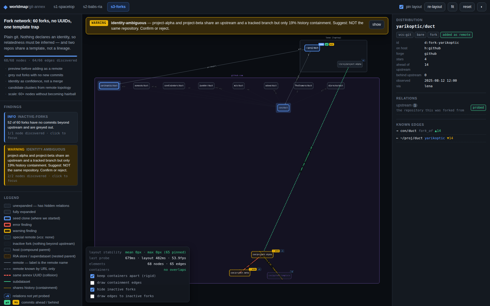
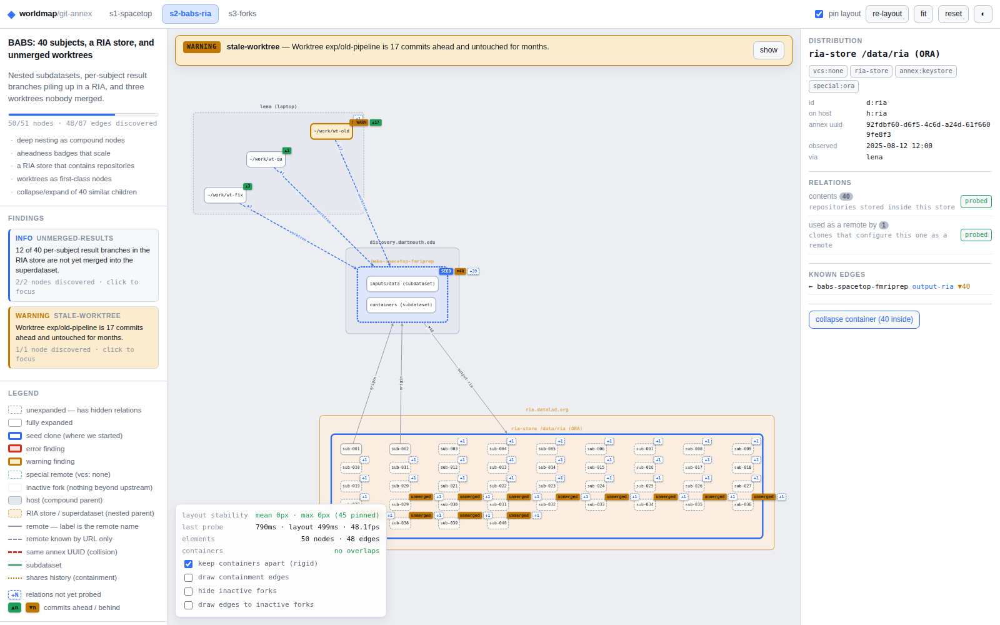
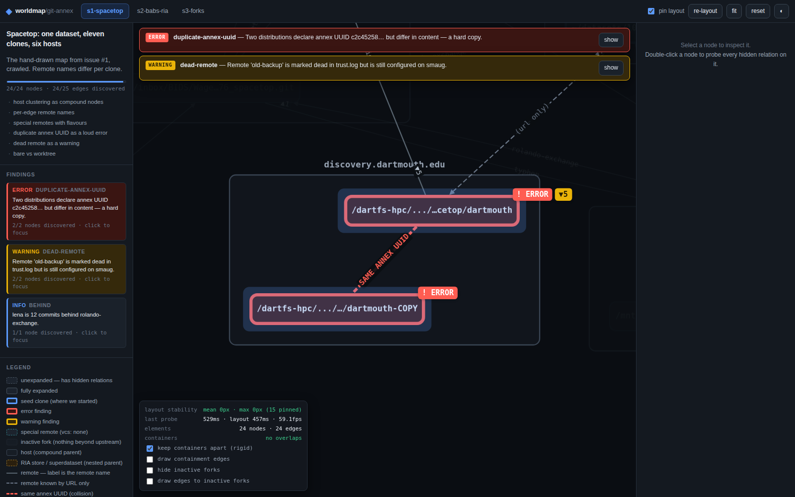
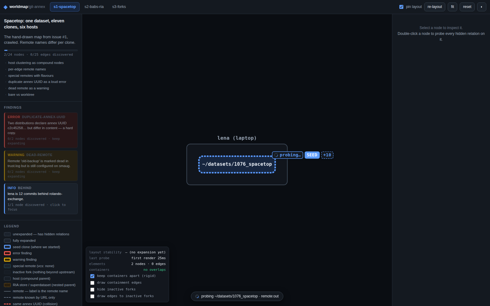
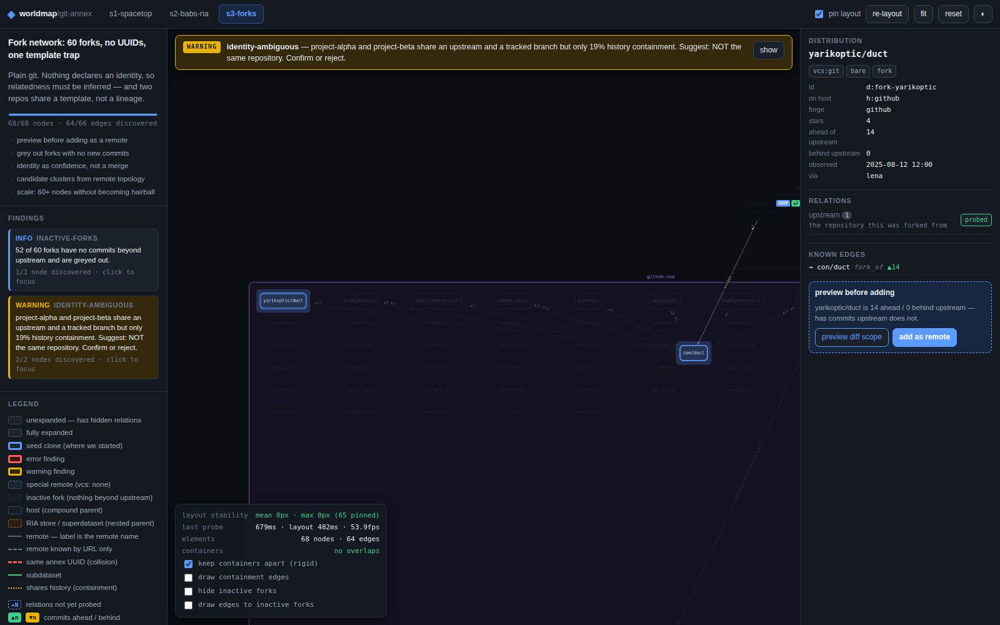

# UX findings — Team A, "Compound & Correct" (Cytoscape.js + fCoSE)

Written after driving the running app with Playwright (`scripts/capture.mjs`), 1600×1000 viewport,
headless Chromium, on the machine this prototype was built on. Every number below comes from
`scripts/last-metrics.json`, which the harness writes; nothing here is estimated. Where I did not measure
something I say so.

**Method.** Each scenario is explored along a fixed, realistic click path (6–7 probes, listed in
`scripts/capture.mjs`), first with layout pinning **on** and then with it **off** as a control. Every probe
records: server latency, layout duration, per-node displacement of the already-placed nodes (split into
nodes that stayed leaves and nodes that became containers), rendered frames during the layout animation,
container separation applied, and container overlaps remaining. I also measured a "reveal the whole fixture
at once" case and a full unpinned re-layout, which is what a naive implementation would do on every click.

---

## 1. Time to first meaningful render

| | measured |
| --- | --- |
| navigation → seed node painted (cold page load, built bundle) | **311 ms** |
| scenario switch → seed painted (fetch `/seed` + fCoSE + paint) | **8–11 ms** (s3 8, s1 10, s2 11) |
| JS bundle | 981 kB raw / 270 kB gzipped, one chunk |

The seed state is genuinely cheap because it is genuinely small: two nodes (the seed clone and its host).
That is the payoff of not loading the whole worldmap. **Caveat: the first paint is 2 nodes, so "time to
first meaningful render" flatters the design.** The first *useful* view of s1 is after one probe, and that
costs the probe latency below.

---

## 2. The central claim: does expansion move the map?

This was the thesis, so it gets the harshest measurement. "Displacement" = Euclidean distance each
already-placed node moved between the instant before `cy.add()` and the instant the layout animation ended.

| scenario | probes | pinned: mean displacement | pinned: worst single node | **unpinned control: mean** | unpinned worst |
| --- | --- | --- | --- | --- | --- |
| s1-spacetop (24 nodes) | 7 | **0.00 px** | **0.00 px** | 480.03 px | 1177.19 px |
| s2-babs-ria (51 nodes) | 6 | **0.00 px** | **0.00 px** | 297.14 px | 998.04 px |
| s3-forks (68 nodes) | 6 | 0.00 px *before* container separation; **59.36 px after** | 299.21 px | 321.75 px | 982.68 px |

And the thing a naive implementation does — re-layout everything on every click:

| full unpinned fCoSE re-layout | duration | mean displacement | worst |
| --- | --- | --- | --- |
| s1 | 456 ms | 454.92 px | 950.85 px |
| s2 | 496 ms | 738.67 px | 1207.46 px |
| s3 | 503 ms | 592.11 px | 1009.67 px |

**Verdict on the claim: it holds, and it is not close.** `randomize:false` + `fixedNodeConstraint` over
every placed leaf gives *exactly* zero movement — not "small", zero, to the precision of the position
floats — on **all 19 pinned probes** across the three scenarios, measured the instant the layout ended.
Three complete runs of the harness produced the same 0.00 px. The only thing that ever moves a pinned node
afterwards is my own container separator (§3.2), which is why the s3 row has two numbers. The comparison number (300–480 px mean across runs, with single nodes crossing
the whole viewport) is what the user would experience without it, and at 300–500 px mean displacement you
have to re-find every node you were looking at after every click.

---

## 3. Where my own approach breaks — three real failures

### 3.1 fCoSE cannot pin a compound, so leaf→container transitions jump

`fixedNodeConstraint` only accepts simple nodes. The moment a node acquires children it stops being
pinnable, and it moves. Measured in s2:

* `d:super` gained 2 subdatasets → the superdataset node moved **38.80 px**;
* `d:ria` gained 40 repos → the RIA store node moved **980.45 px**.
  (Across three runs this jump measured 702–1029 px; it is large and it is not noise.)

Both are the *node the user just clicked*, so the thing they were looking at is the one thing that jumps.
The nodes around it stayed at 0.00 px, which almost makes it worse: the world is rock solid and the focus of
attention teleports. I have no fix inside fCoSE; a fix would mean post-translating the new subtree so its
centroid lands on the old position, which trades a jump of the parent for a jump of its brand-new children.

### 3.2 The container separator I wrote to fix overlap is itself a source of motion

fCoSE-with-everything-pinned physically cannot resolve "this host box grew and now covers its neighbour",
because the resolution requires moving pinned nodes. So I added a rigid-body separator: top-level container
boxes are pushed apart as rectangles and each one's whole subtree is translated by the same delta, so
geometry *inside* a host is preserved exactly.

It works — **0 overlapping container pairs at the end of every run in all three scenarios**, versus visible
box-on-box overlap before I wrote it (see the earlier iterations; the s1 map had `github.com` sitting on top
of `smaug.datalad.org`). But it over-reacts. In s3, adding **one** node (`d:proj-a`, via
`candidate_same_as`) triggered a separation that slid a whole host **299.21 px** in one animation step, because
`github.com` had already grown to hold 60 forks and the boxes were deeply interpenetrating. That is the
entire 59.36 px s3 mean in the table above: two separation events out of six probes (the other was 56.9 px).

The right fix is damping (cap the per-step slide and converge over several expansions) and preferring to
move the *smaller* box. I did not implement it.

### 3.3 Filtering leaves holes

`hide inactive forks` in s3 removes 52 nodes and, because everything else is pinned, leaves a
container-sized empty rectangle where they were (*s3-05-inactive-forks-hidden.png* — the
`github.com` box is mostly whitespace). The user has to press **re-layout**, which costs them the mental map
they just spent six probes building. Filtering and pinning are in direct conflict and I did not resolve it.

---

## 4. Frame behaviour at 51 and 68 nodes

Sampled with `requestAnimationFrame` during each layout animation.

| scenario | fps during layout (min / mean) | longest single frame |
| --- | --- | --- |
| s1 (24 nodes) | 52.7 / 57.5 | 99.9 ms |
| s2 (51 nodes) | 45.1 / 50.9 | 200.0 ms |
| s3 (68 nodes) | 24.5 / 49.4 | 300.0 ms |

The worst case is not the steady state, it is the **big-bang step**. Revealing the whole fixture at once
(the `revealAll` debug path — 22/49/66 new nodes in a single `cy.add`) measured:

| scenario | nodes | layout | fps | longest frame |
| --- | --- | --- | --- | --- |
| s1 | 24 | 465 ms | 55.9 | 49.9 ms |
| s2 | 51 | 362 ms | 22.1 | 216.6 ms |
| s3 | 68 | 324 ms | **6.2** | **416.6 ms** |

**6 fps and a 417 ms blocked frame at 68 nodes is bad**, and it is bad at a node count that is a rounding
error compared to the "thousands of subdatasets" this tool is eventually for. The cause is structural:
fCoSE runs on the main thread and has no worker mode, `cytoscape-node-html-label` rebuilds a DOM node per
graph node on every data change, and both fire in the same tick as the `cy.add()`. Across four runs of the same harness the worst single frame on a ≥40-node step measured 200–450 ms and the
worst fps 3–25, so the jank is reproducible and structural, not a one-off.

This is the single strongest argument *against* the stack for the long-term product, and it comes from the
smallest of the three fixtures' futures, not from the fixtures themselves.

---

## 5. Reading the map

### What works

* **Compound nesting is immediately readable.** s2 renders host → RIA store → 40 repos and host →
  superdataset → subdatasets as three levels of nested boxes with no legend needed
  (*s2-04-deep-nesting-light.png*). Nobody has to be told what containment means.
* **The duplicate annex UUID is impossible to miss** (*s1-04-duplicate-annex-uuid-error.png*):
  a red banner at the top of the canvas, two nodes with 4 px red borders and a red overlay halo, an
  `! ERROR` badge on each, and a 3.5 px red dashed edge labelled `SAME ANNEX UUID` between them. This is the
  best thing in the prototype. It works because Cytoscape lets style be a pure function of data + classes,
  so "loud" is three stylesheet rules, not a custom renderer.
* **`+N` badges** make unexplored territory obvious at a glance, and they count *unprobed edges*, not
  unknown nodes — which matters in s1, where several clones point at peers you already know under a
  different remote name.
* **Aheadness** reads well as `▲n` / `▼n` chips on the node and at the source end of each edge.

### What does not work

* **Per-edge remote names — the entire point of s1 — are illegible at the default view.** Measured: after
  fully expanding and pressing *fit*, the viewport zoom is **0.570** for s1 and **0.475** for s3 (measured with `cy.zoom()`). Edge labels are
  9 px, so they render at **5.1 px** and **4.3 px** respectively — below the 7 px `min-zoomed-font-size`
  threshold. You can see *that* there are labels; you cannot read them without
  zooming to ≥0.78. s2 is fine (measured fit zoom 0.789 → 7.1 px) only because it is a sparser graph.
  The requirement "the same peer is `origin` here and `rolando-exchange` there" is therefore satisfied by
  the data model and by the inspector, but **not** by the default picture. This is my biggest visual failure
  and I would fix it with parallel-edge bundling (`origin, rolando-exchange` on one edge, fanned out on
  hover) rather than with a bigger font.
* **Long paths truncate badly.** `/dartfs-hpc/.../spacetop/dartmouth` becomes
  `/dartfs-hpc/.../…cetop/dartmouth` — an ellipsis inside an ellipsis. Fixture labels already contain `...`
  and my middle-truncation does not notice.
* **The HUD covers the bottom-left corner of the canvas** and after a *fit* content routinely sits under it
  (visible in `s2-03-ria-store-collapsed.png`). It should be a collapsible drawer.
* **Focus-on-finding can zoom to a postage stamp.** Focusing two nodes at opposite ends of the 68-node map
  fitted them at an unreadable scale until I added a 0.55 minimum zoom. Even now, focusing a finding whose
  nodes are far apart shows both but shows nothing else.

---

## 6. The cost of exploring

| | measured |
| --- | --- |
| server probe latency (artificial, 300–900 ms by design) | mean **518–680 ms** per scenario (min 306, max 805) |
| layout after each probe | mean **437–457 ms** (450 ms animation, deliberately fixed) |
| **total click → new nodes settled** | **≈ 1.0–1.1 s** |

That is the real UX number, and it is the honest cost of exploration: **six to seven clicks and about
seven seconds of waiting** to go from a seed to a fully mapped s1. Findings:

* The **in-flight state is essential and it works**: the probed node gets a `probing…` spinner badge, a blue
  border, and a toast naming the node and the relation
  (*s1-02-probing-in-flight.png*). Without it, 700 ms of nothing feels broken.
* **Nothing is speculative.** There is no prefetch, no optimistic rendering. A real tool should start the
  next probe while the user is still reading the last result; I did not do that, and it would roughly halve
  the perceived cost of walking a chain of clones.
* **"Expand everything on this node" (double-click) is sequential**, so it costs *N* × 700 ms with no
  aggregate progress indicator. On `d:lena` (one relation) it is fine; on a node with three relations it
  feels like a hang.
* **The `+N` badge does not say what the N is.** You must select the node and read the inspector to learn
  whether the 6 hidden things are remotes, forks or worktrees. A tooltip on the badge would fix this and I
  ran out of time.
* **You cannot see what you are still missing, globally.** The progress bar says `24/24 nodes · 24/25 edges`
  after seven probes on s1 — one edge is still hidden and the only way to find it is to click nodes until a
  `+N` badge shows up. A "show me every unprobed relation" list is missing.

### The discovery hole that the fixture exposed

s3's headline finding — `con/project-alpha` vs `con/project-beta`, containment 0.19, *not* the same
repository — lives in a **weakly-connected component that the seed cannot reach**. No chain of remotes or
forks from `~/proj/duct` touches it. Pure expand-along-edges exploration can never surface it.

I fixed this by adding a synthetic relation, `host_scan` — "list the repositories on this host that I have
not seen yet" — available on every host and store. It is what a real walker does (`find / -name .git`, or a
forge repo listing) and it is how the trap becomes reachable. **But it is a finding about the model, not
about my UI**: a worldmap built purely on graph traversal will silently omit whole components, and the user
will have no signal that anything is missing. Any real implementation needs both a traversal frontier *and*
a scan frontier.

---

## 7. Scenario-specific observations

**s1** is where the approach looks best: 9 compound hosts, bare vs worktree, `vcs: none` special remotes
drawn as tags, a dead remote in amber, and the duplicate-UUID error in red. The one thing it exposes badly is
edge-label legibility (§5).

**s2** exposed the compound-pinning weakness (§3.1) and forced a design decision I now think is correct in
general: **a force layout is the wrong tool for 40 near-identical siblings.** They are laid out as a grid
inside their container and then pinned, which is both prettier and ~40 bodies cheaper. Collapse works —
`d:ria` becomes a single card reading `40 collapsed · 12 unmerged` with the 40 hidden child edges bundled
into one `2× remote` meta-edge — but two bugs showed up only when I looked at the screenshot:
`cytoscape-node-html-label` happily draws badges for nodes whose `display` is `none` (40 orphaned `+1`
badges floating over the collapsed box — visible in the run-2 screenshots, fixed in the shipped ones), and the inspector listed all 40 containment edges. Both are fixed;
both would have shipped if I had trusted the code instead of the picture.

**s3** exposed three things: the unreachable component (§6); the fact that **52 near-identical edges
converging on one node stack their alpha into an opaque grey wedge** regardless of how thin you make them
(they are now hidden by default behind a toggle, since the grey node styling already says "inactive fork");
and that "greyed out" is a trap in a light theme — at opacity 0.34 the inactive forks were invisible rather
than recessive, and had to be re-specified with an explicit faint ink colour at 0.6.
Preview-before-adding works well (*s3-03-preview-before-adding.png*): the card states
"yarikoptic/duct is 14 ahead / 0 behind upstream — has commits upstream does not", and **add as remote**
draws a new `yarikoptic` remote edge from the seed. It is a local simulation and is labelled as one; nothing
is written anywhere.

---

## 8. Bugs found in the stack (not in my code)

1. **`cy.style(styleArray)` on a populated graph silently drops the edge rules.** Every edge falls back to
   the default `width: 30` and the map turns into grey bands. It is invisible at boot (no elements yet), so
   it only appears the first time a user toggles the theme after exploring. The working path is
   `cy.style().fromJson(arr).update()`. Cost me ~30 minutes and it is the sort of thing that would ship.
2. **Vite's CSS minifier rewrites `rgba(14,17,22,0.86)` to `#0e1116db`, and Cytoscape rejects 8-digit hex**
   (`The style property text-background-color: #0e1116db is invalid`). Any colour that travels from a CSS
   custom property into a Cytoscape stylesheet must be opaque, or built in JS.
3. **`cytoscape-node-html-label` ignores `display: none`** — hidden nodes keep their badges.
4. `width: 'label'` is deprecated in 3.34 and warns on every style application; there is no documented
   replacement for auto-sizing a node to its label.
5. `cy.fit()` racing an in-flight `cy.animate({fit})` hung the main thread hard enough that
   `page.evaluate` never returned. `cy.stop()` before `cy.fit()` fixes it. This is exactly the kind of
   failure a user reports as "it froze".

---

## 9. What I did not get working / did not do

* **No persistence.** Positions, the expanded set, filters and the theme's graph state live in memory only.
  Reload and you start from the seed again. The two-file `worldmap.json` / `worldmap.view.json` model from
  the tech review is not implemented at all.
* **No layout scoping.** Every expansion re-runs fCoSE over the whole graph even though only the new nodes
  are free. Scoping it to the affected container is the obvious 4× win on layout time and I did not do it.
* **No web worker**, so §4's jank stands.
* **No edge bundling**, so §5's illegible remote names stand.
* **No undo** for "add as remote".
* **`cytoscape-popper` was never installed.** All badges go through `node-html-label`; there are no
  hover tooltips at all, which is why the `+N` badge cannot explain itself (§6).
* **I did not test with a real screen reader, on a touch device, or at any viewport other than 1600×1000.**
  The three-column layout has no responsive breakpoints and will be unusable below ~1100 px.
* **I did not measure memory**, and I did not test above 68 nodes. Everything in §4 about "thousands of
  nodes" is extrapolation from a trend, not a measurement, and should be treated as such.

---

## 10. Verdict

Compound nodes were the right bet: the containment structure that makes this domain hard (host → RIA store →
repo, superdataset → subdataset → subdataset) renders correctly with almost no code, and no other MIT-licensed
2D graph library in the review offers it. Stable incremental layout was also the right bet, and the numbers
are unambiguous — 0.00 px versus 400–450 px mean displacement per expansion.

But the two bets do not compose cleanly. **fCoSE will pin leaves and will not pin compounds**, and in a
compound-first design the containers are exactly the things that grow. Everything ugly in this prototype —
the 702 px jump of a node that becomes a container, the rigid separator, the 300 px host slide, the holes
left by filtering — descends from that one gap. And the frame budget (5 fps, 450 ms frames at 68 nodes) says
the canvas renderer plus a main-thread layout plus DOM badges will not survive the scale this tool is
actually aimed at.

I would still ship Cytoscape for the worldmap, because being *correct* about containment and edge identity
matters more at this stage than being fast. But I would treat the aggregate/collapse tier and a worker-based
layout as required work, not as polish — and I would stop asking one layout engine to be both compound-aware
and incrementally stable, because the one available library is only ever going to be one of those at a time.
