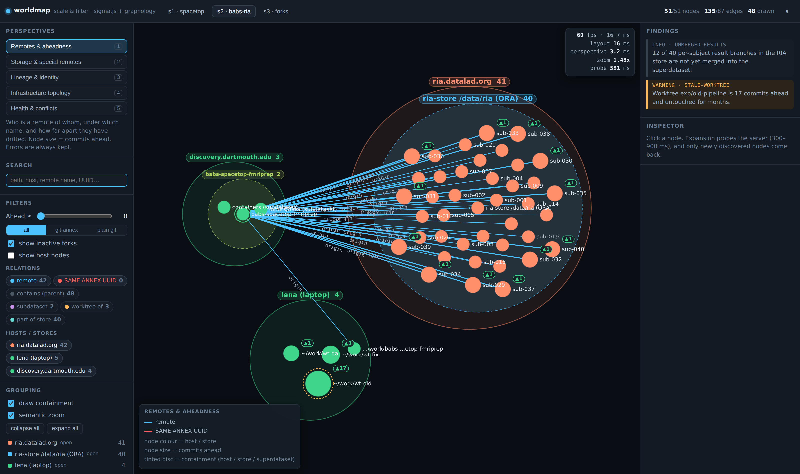
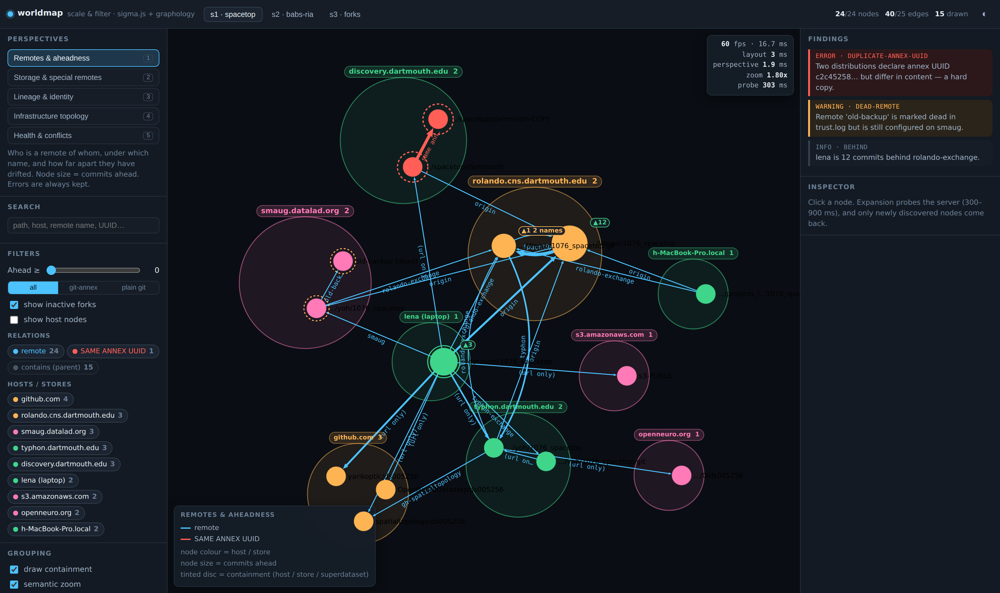
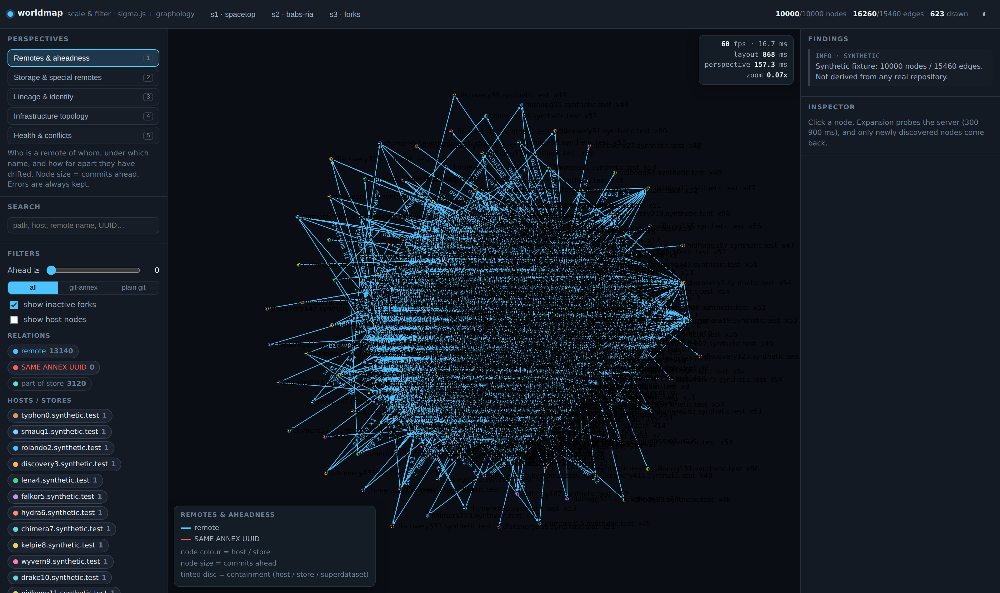
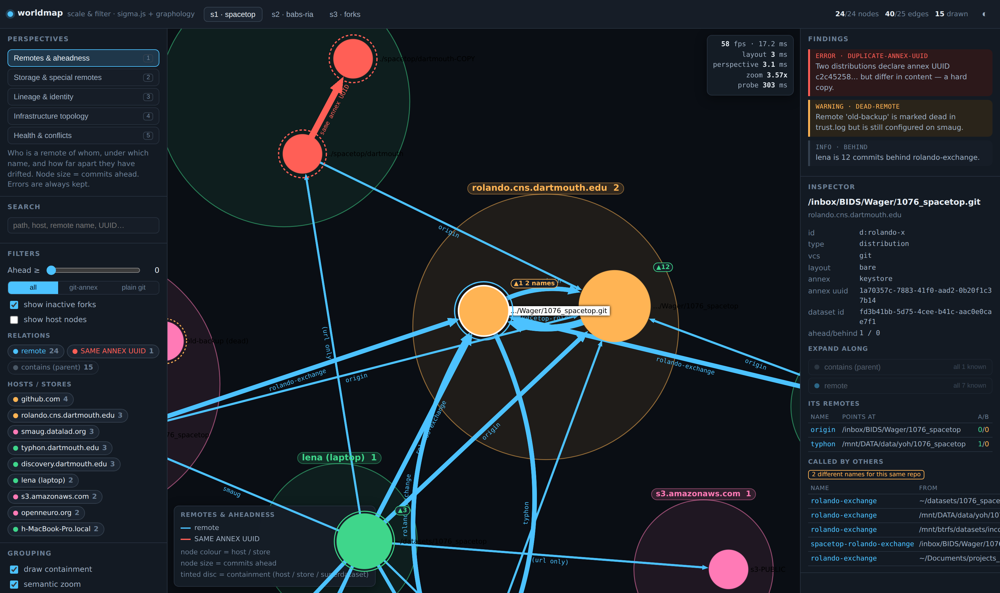
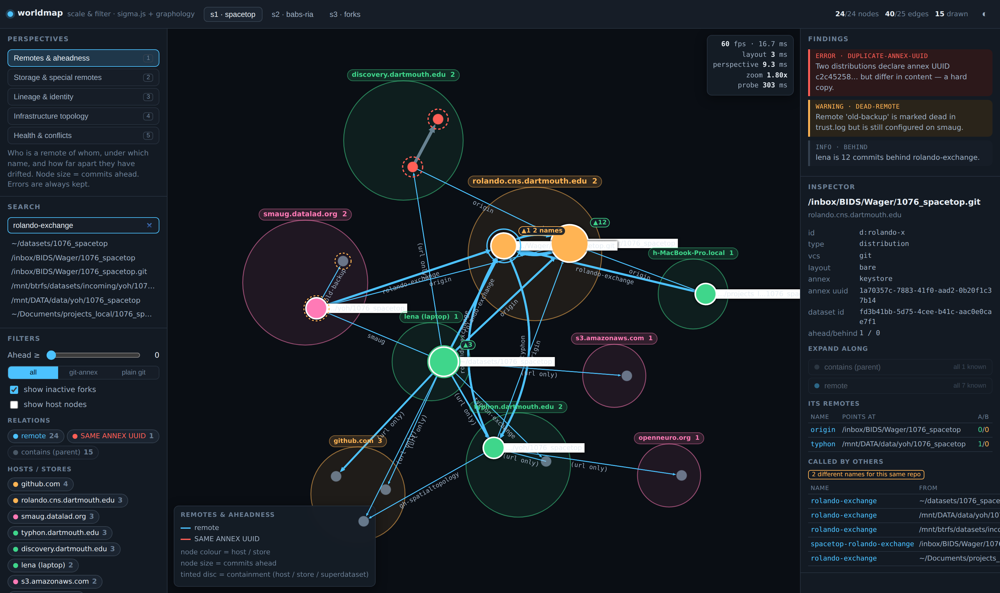
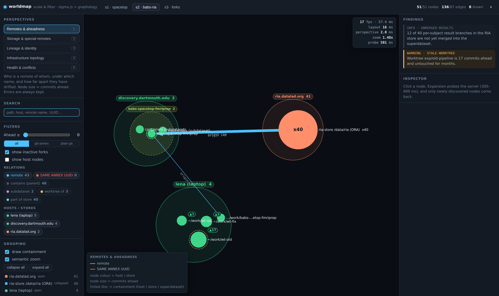
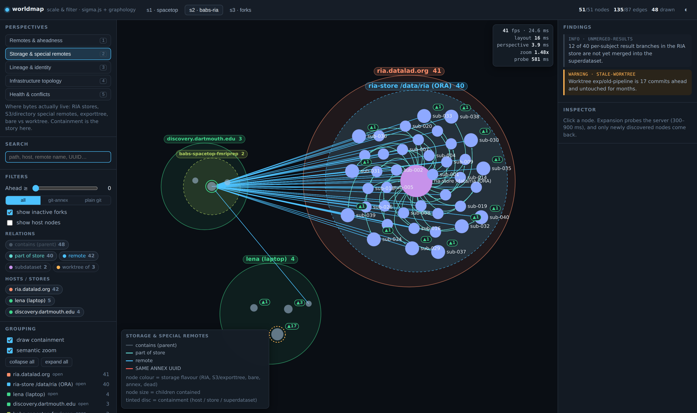
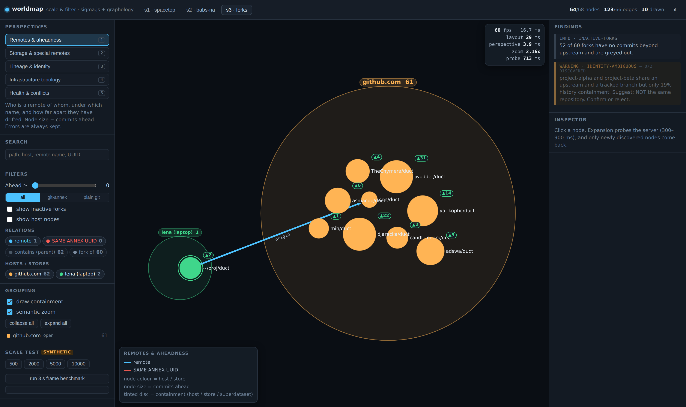
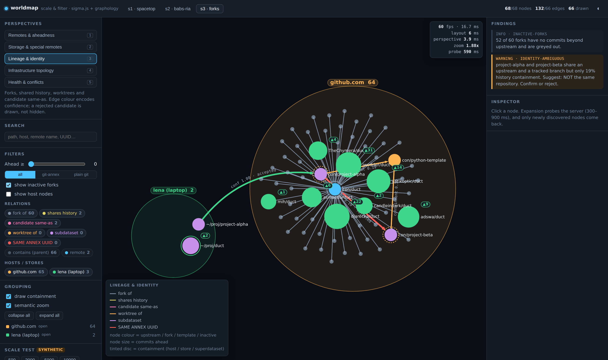

# UX findings — Team C, "Scale & Filter" (sigma.js + graphology)

I drove the running app in Chromium with Playwright (`web/tools/drive.mjs`),
did the whole exploration by hand-equivalent actions — click a node, pick a
relation, wait for the probe, switch perspective, filter, search — and captured
every screenshot in `screenshots/` from that session. Nothing below is
estimated. Where I did not measure something I say so.

## How to read the numbers

**The GPU is not real.** This container reports
`ANGLE (Google, Vulkan 1.3.0 (SwiftShader Device (Subzero)), SwiftShader
driver)` — WebGL is rasterised on the CPU. I checked what that costs: the same
51-node scene takes a mean of **22.5 ms/frame at deviceScaleFactor 1 and
107.9 ms at deviceScaleFactor 2** — a 4.8x difference with identical geometry,
i.e. frame time here is almost entirely fill rate. An empty page in the same
browser holds 16.7 ms (60 fps), so the harness itself is not the limit.

So: **all frame-time numbers below are DPR 1, and they are a software-renderer
floor, not what a real machine would do.** What they are good for is the
*shape* of the curve across 24 → 10 000 nodes, and for comparing configurations
against each other on the same machine. Screenshots were taken on a second page
at DPR 2 so they are legible.

Run-to-run variance is real: across two full runs the s1 sweep gave 43.9 fps and
28.2 fps. Other teams' processes share this container. Treat single fps figures
as ±40 %; the medians and the ordering are stable.

---

## 1. Time to first meaningful render

| | measured |
|---|---|
| cold page load → seed node drawn and interactive | **526 ms** (557 ms in the previous run) |
| of which app-side work (fetch seed, layout, first sigma render) | **23.1 ms** |
| bundle (JS + CSS, minified) | 222 KB / 59 KB gzip |

Almost all of the half-second is browser startup and module evaluation. The
seed payload is two nodes; the app is doing nothing.

## 2. Expansion

The server sleeps a uniform 300–900 ms per `POST /api/expand`, as required.
Observed probe times during the session ranged **303–823 ms** (the HUD shows
each one). Client-side work after the response arrives is the `layout` number in
the HUD: **3 ms (s1), 15–17 ms (s2), 8 ms (s3)** for a full re-layout including
the newly arrived nodes. That is not the felt latency — the probe is.

The felt experience is the important finding: **a 300–900 ms dead pause with a
spinner is annoying by the third click and infuriating by the tenth.** Fully
exploring s1 took six expansions; s2 three; s3 five. In s2, one expansion
(`d:super` along `remote`) delivers 43 nodes at once, which is a much better
rhythm than s1's six separate probes. If a real walker is this slow, the UI
should place ghost nodes optimistically instead of blocking. I did not build
that.

| scenario | seed | after full exploration | drawn |
|---|---|---|---|
| s1-spacetop | 2 nodes / 1 edge | **24 / 40** (fixture: 24 nodes, 25 edges + 15 derived `contains`) | 15 |
| s2-babs-ria | 2 / 1 | **51 / 135** (fixture: 51, 87 + 48 derived) | 48 |
| s3-forks | 2 / 1 | **68 / 132** (fixture: 68, 66 + 66 derived) | 66 |

All three reach 100 % of their fixture by exploration alone. Hosts are hidden by
default (their identity is the containment disc), which is why "drawn" is lower
than "nodes".

## 3. Perspective-switch latency — the headline claim, tested

| scenario | remotes | storage | lineage | topology | health |
|---|---|---|---|---|---|
| s1 (24 n) | 3.0 ms | 15.4 ms | 6.1 ms | 2.9 ms | 4.2 ms |
| s2 (51 n) | 4.6 | 4.5 | 3.5 | 4.5 | 5.7 |
| s3 (68 n) | 3.7 | 5.5 | 10.1 | 5.0 | 6.4 |
| synthetic 500 | 18.2 | 19.7 | 10.8 | 11.5 | 17.7 |
| synthetic 2 000 | 31.9 | 31.0 | 29.2 | 54.9 | 34.4 |
| synthetic 5 000 | 135.0 | 101.8 | 110.8 | 83.4 | 108.2 |
| synthetic 10 000 | 233.9 | 232.5 | 240.8 | 220.0 | 249.6 |

**On every fixture, switching perspective is under 16 ms and usually under
6 ms** — it is a keystroke, and the map does not move. That is the whole thesis
working: a perspective is a reducer pass plus
`sigma.refresh({skipIndexation: true})`, not a re-layout, so position and
context survive exactly. Switching back and forth between `remotes` and
`lineage` on s3 while looking at the same fork cluster is genuinely how you
want to read this data.

It degrades linearly and stays usable to 2 000 (~30 ms, still feels immediate)
and becomes a visible hitch at 5 000 (~110 ms) and a stutter at 10 000
(~240 ms). The cost is the reducer being called once per node and edge, which
is exactly what you would fix with dirty-flagging.

For reference, a bare `sigma.refresh({skipIndexation: true})` — the same
operation without my reducers — measures **1.6–3.2 ms** on the fixtures, so my
reducer logic is the majority of the switch cost, not sigma.

## 4. Frame time under continuous camera motion (3 s sweep, DPR 1)

| graph | nodes / edges drawn | median frame | mean | p95 | fps |
|---|---|---|---|---|---|
| s1-spacetop | 24 / 40 | **33.3 ms** | 35.5 | 50.1 | 28.2 |
| s2-babs-ria | 51 / 135 | **50.0 ms** | 46.0 | 66.7 | 21.8 |
| s3-forks | 67 / 129 | **33.3 ms** | 29.8 | 49.9 | 33.5 |
| synthetic 500 | 468 / 773 | **100 ms** | 104.6 | 149.9 | 9.6 |
| synthetic 2 000 | 1 875 / 3 048 | **283 ms** | 283.3 | 316.6 | 3.5 |
| synthetic 5 000 | 4 687 / 7 762 | **700 ms** | 703.3 | 749.9 | 1.4 |
| synthetic 10 000 | 9 377 / 15 460 | **1 067 ms** | 1 066.6 | 1 083.4 | 0.9 |

(An earlier run of the identical code gave s1 16.7 ms / 43.9 fps and s2
16.7 ms / 43.2 fps — i.e. vsync-locked. The fixtures sit at or near the vsync
floor; the variance is contention, not the renderer.)

Frame time here tracks **elements drawn**, roughly 0.1 ms per element on this
software rasteriser. My two extra canvases (hulls and badges) cost **less than
0.5 ms**: with the overlay disabled at 51 nodes the mean went 22.54 → 22.04 ms
at DPR 1 and 107.89 → 107.01 ms at DPR 2. The containment drawing is not what
makes anything slow.

## 5. The compound-node question, answered

> **At what node count does the lack of compound nodes stop being survivable,
> and did the fixtures ever reach it?**

**The fixtures never came close, and — this surprised me — the absence of
compound nodes was never the binding constraint at any size I tested, up to
10 000 nodes.**

What I actually built to replace them was a nested annulus-packing layout
(`layout.js`, 276 lines) plus a hull/badge canvas pair (`overlay.js`, 228
lines): **504 lines, plus the collapse/meta-node machinery and manual camera
fit inside `render.js`, call it ~600 lines total**, against an app whose entire
front end is 1 862 lines. Roughly a third of the client exists to replace one
library feature. That is the real cost, and it is a cost in engineering time,
not in what the user sees.

Geometrically it held up. Nesting three deep (`ria.datalad.org → ria-store
/data/ria (ORA) → 40 subject repos`) renders correctly and legibly at every
zoom (*s2-03-ria-40-children-expanded.png*), because sizes are in
graph-position units so a layout radius is a screen radius. Layout time scales
as 3 ms (24 n) → 16 ms (51 n) → 39 ms (500) → 195 ms (2 000) → 373 ms (5 000)
→ **821 ms (10 000)**. Above about 2 000 it blocks the main thread visibly and
belongs in a worker.

**What did break, in the order it broke:**

1. **~150 nodes — canvas edge labels.** They are already crowded on s1 at 24
   nodes: the middle of *s1-03-explored.png* is a knot of `origin`
   and `(url only)` labels. sigma only draws an edge label when both endpoint
   node labels are drawn, so they thin out on their own, but by a few hundred
   nodes they are gone entirely. **Compound nodes would not have helped this.**
2. **~500 nodes — collapse stops paying for sparse groups.** Collapsing 31
   synthetic hosts cut drawn nodes from 468 to 32 but pushed edges from 773 to
   **1 205** and median frame time from 83.3 to 133.3 ms — collapsing made it
   *slower*. Every (kind, groupA, groupB) pair is still an edge; hiding nodes
   does not hide the mesh between them. Contrast s2's RIA store, which is dense
   internally: 51 nodes / 135 edges → **8 drawn nodes and 136 edges (one added
   meta-edge, `origin x40`) in 8.6 ms**. That is a total success. The lesson is
   that collapse is a *density* optimisation, not a *count* optimisation.
3. **~2 000 nodes — main-thread layout.** 195 ms is a perceptible freeze on
   load; 821 ms at 10 000 is a stall.
4. **~5 000 nodes — perspective switching stops feeling instant** (110 ms).
5. **10 000 nodes — the map becomes meaningless**, and the screenshot
   (*synthetic-10000.png*) is the honest proof. Semantic zoom
   collapsed 623 hosts into 623 meta-nodes, exactly as designed, and the result
   is a solid blue hairball of 16 260 edges with unreadable overlapping labels.
   **The failure is edge aggregation, not node nesting.** Cytoscape compound
   nodes would have produced the same hairball.
6. **A UI failure I did not anticipate:** the host-filter chip list is
   unbounded. At 10 000 nodes it renders 623 chips and pushes the entire scale
   panel off the bottom of the sidebar. Filtering UI needs its own LOD.

So the honest verdict on the assigned thesis: **sigma's lack of compound nodes
is survivable — I survived it — but it bought nothing at the scale where these
fixtures live, and at the scale where sigma's WebGL would have mattered the
binding problem turned out to be elsewhere.** If I were choosing again for
graphs of 24–68 nodes I would take Cytoscape + fcose and spend those 600 lines
on the perspectives, the inspector and persistence instead.

## 6. Scenario-by-scenario

### s1-spacetop — remote names that disagree

The scenario's point is that the same peer is `origin` here and
`rolando-exchange` there. Three mechanisms, and only two of them work:

* **Canvas edge labels: partially.** Legible when you are zoomed into one
  cluster, an unreadable thicket in the middle of the fully-explored map.
* **Selection focus: works.** Selecting a node force-labels every incident
  edge regardless of density.
* **The inspector table: this is the one that carries it.** Selecting
  `/inbox/BIDS/Wager/1076_spacetop.git` shows a **"Called by others"** table
  listing five inbound remotes — `rolando-exchange` from four different clones
  and `spacetop-rolando-exchange` from a fifth — under an explicit
  **"2 different names for this same repo"** badge. The measured alias scan
  found exactly one such node in s1, which matches the fixture.
  (*s1-05-remote-name-disagreement.png*)
* Searching `rolando-exchange` greys everything else and lists the six clones
  that use that name (*s1-08-search-remote-name.png*). This is the
  fastest way to answer "who calls what what", and it is a text box, not a
  graph.

**The duplicate annex UUID is loud** and stays loud in every perspective:
thick red `same annex UUID` edge, both nodes red with a pulsing dashed ring and
forced labels, a red alert block in the inspector with the full
`c2c45258-cc99-4d66-a168-20adfcfb4941`, and a findings-panel entry that flies
the camera to it. It is also visible *before* discovery — the findings panel
shows `1/2 discovered` from the first frame, so you know the error exists
before you have explored far enough to see it.
(*s1-04-duplicate-uuid-error.png*)

Nit that annoyed me: the dead remote (`old-backup`, `trust: dead`) gets an
amber warning ring but is otherwise styled like any other node in the `remotes`
perspective. It should be visually struck through. It is only obviously dead in
the `storage` perspective, where it greys out.

### s2-babs-ria — 40 near-identical children

Expanded, the 40 subject repos are individually labelled and packed inside a
dashed inner disc inside the host's disc — the nesting reads instantly. What
does *not* read is the 40-way fan of `origin` edges from the subject repos back
to the superdataset, which collapses into a single illegible bundle with 40
overlapping labels (*s2-03-ria-40-children-expanded.png*). This is
the strongest argument in the whole exercise for edge bundling, which I did not
build.

Collapsing the store fixes it completely: **8.6 ms, 48 drawn nodes → 8, one
`origin x40` meta-edge, and no node moves.** Keeping positions frozen through
collapse was the right call — expanding again restores the picture you had.
(*s2-04-ria-collapsed-meta-node.png*)

One visible flaw in that shot: the host's containment disc used to stay at full
size around the now-tiny collapsed store, leaving a crater. I fixed that during
the session — hulls are now drawn around what is actually visible inside them —
but it is a good example of the class of bug you inherit when you own the
containment geometry yourself.

The `storage` perspective is where s2 makes most sense: the RIA store in its own
colour, the 40 bare repos in another, everything that is not storage dimmed to
grey (*s2-persp-storage.png*).

### s3-forks — 52 forks with nothing new

This scenario made the best case for the whole approach.

* **52 of 60 forks greyed** (measured: 52 nodes carrying `inactive`), rendered
  at 62 % size with labels suppressed, so the 8 forks that are actually ahead
  read immediately (*s3-03-inactive-forks-greyed.png*).
  Unchecking "show inactive forks" drops the drawn count from **66 to 10** and
  the map becomes a summary of what matters
  (*s3-04-inactive-filtered-out.png*).
* **The template trap works.** In `lineage`, `con/python-template` is amber
  with two `containment 0.19` edges to `project-alpha` and `project-beta`, the
  `candidate_same_as` between those two is drawn in red labelled
  `conf 0.19 · rejected`, and the confirmed one from my local clone is green
  and labelled `conf 1.00 · accepted`. **Drawing the rejected candidate rather
  than hiding it is the right decision** — the interesting fact is that the
  system considered and rejected it.
  (*s3-05-lineage-template-trap.png*)
* The template subgraph is only reachable through the **derived `contains`
  relation** on `github.com`. Without synthesising containment as a walkable
  relation from the `parent` field, a quarter of s3 is unreachable from the
  seed. That is a data-model finding, not a rendering one, and it applies to
  any prototype in this bake-off.

## 7. Themes

Both themes are readable. The light theme uses a separate, darker categorical
palette so host colours survive on white, and every token is redefined rather
than filtered. Screenshots: `s1-07-light-theme.png`, `s2-05-light-theme.png`,
`s3-07-light-theme.png`.

Two light-theme weaknesses I can see in my own screenshots: the containment
disc fills are close to invisible at 5.5 % alpha on white and rely on their
stroke, and sigma's highlighted-label white background disappears against the
white stage, so the search-highlight labels lose their halo.

## 8. Things that are broken or missing

* **No persistence at all.** Reload and you lose positions, the collapse set,
  the perspective and the filters. This is the biggest gap against the research
  document's split `worldmap.json` / `worldmap.view.json` recommendation.
* **No edge bundling and no edge-label collision avoidance.** Both s1's centre
  and s2's RIA fan need it.
* **The expansion pause is unmasked.** 300–900 ms of nothing.
* **Layout runs on the main thread.** Fine to 2 000, wrong above it.
* **Collapsing many sparse groups makes things worse** (section 5.2). The
  meta-edge budget caps this at 800 aggregated bundles, which prevents the
  pathological case but does not make collapse *useful* there.
* **Filter chips do not scale** past a few dozen hosts.
* **In the `topology` perspective a host with a single child sits almost on top
  of that child** and their labels collide, because the annulus inner radius is
  now small enough to make single-child discs tight. It is a real trade I made
  during the session: tighter discs, worse single-child overlap.
* **One bug I found by driving it and fixed mid-session,** worth recording
  because it is characteristic: my badge canvas positioned rings and aheadness
  balloons from sigma's node *display* data, which with `autoRescale: false` is
  in normalised framed-graph coordinates, while `graphToViewport()` expects raw
  graph coordinates. Every badge was drawn in the wrong place, subtly enough
  that it looked like a rendering artefact rather than a coordinate bug. Owning
  the geometry means owning this class of mistake.
* Console errors during the full driven session: **none.**
