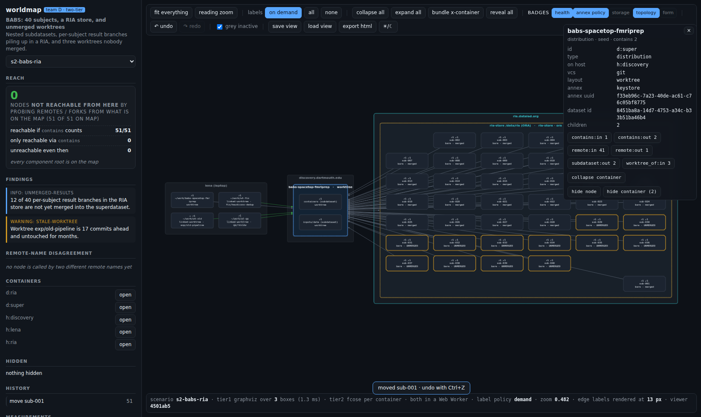
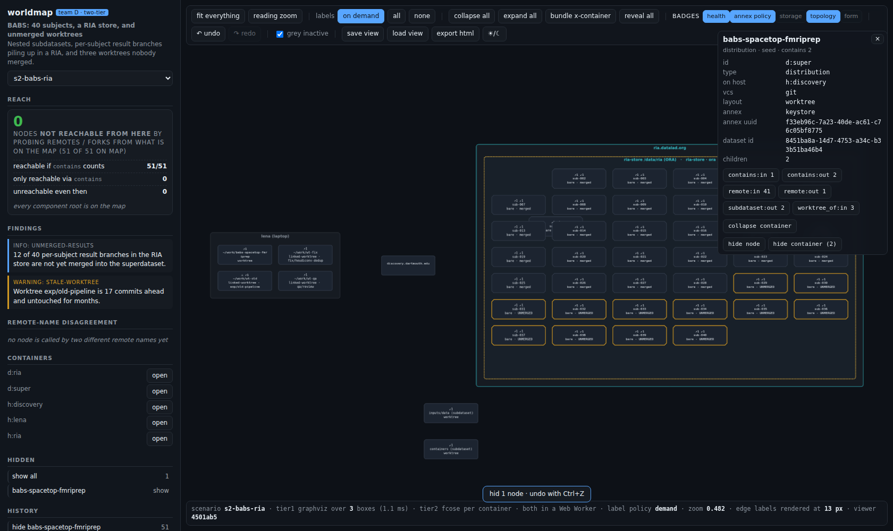
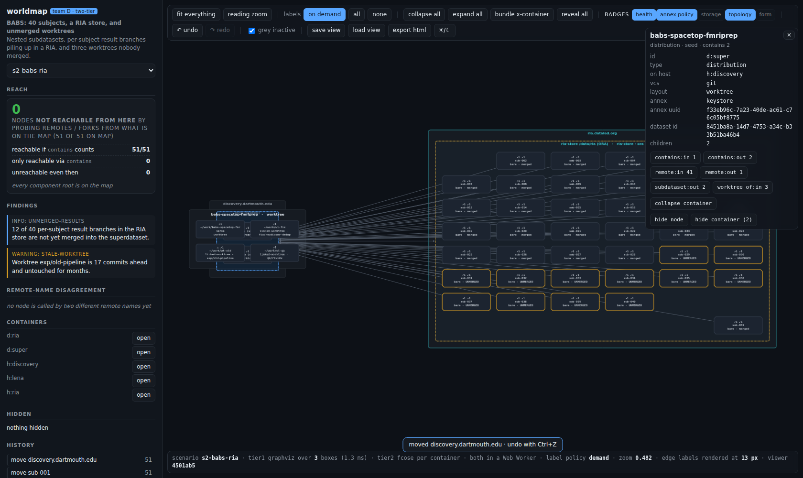
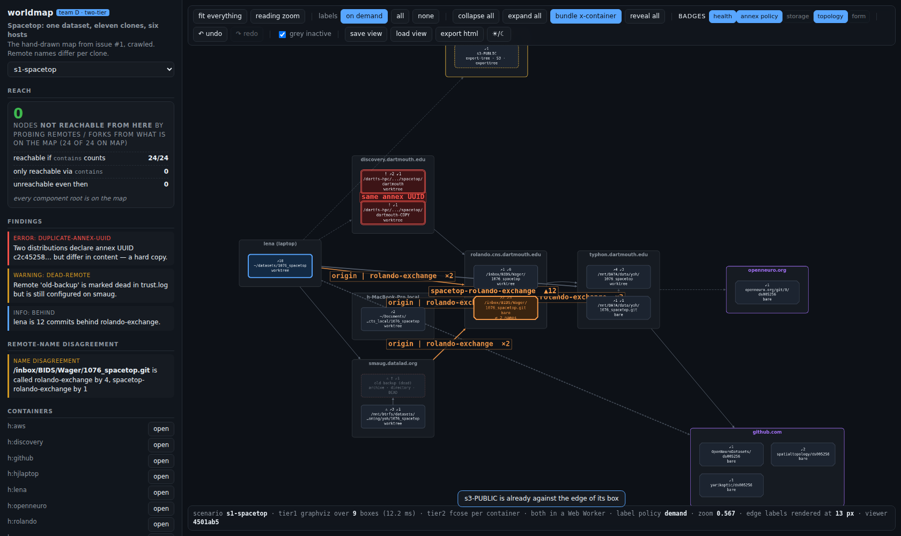

# UX findings — drag to reposition × bundle cross-container edges

A second UX pass, aimed only at the two features added after
[`UX-FINDINGS.md`](UX-FINDINGS.md) was written, and only at the **combinations**
nobody had exercised: drag × bundle, drag × collapse, drag × expand, drag ×
undo, drag × hide, drag × save/load, bundle × collapse, and the edge cases.
The verdict going in was "a little buggy but works". It was buggier than that.

Everything below was measured by driving the running app with a **real mouse**
(`mouse.down` / `mouse.move` / `mouse.up` over the canvas, so cytoscape's own
`grab` / `dragfree` path is under test — no poking `S.layout` directly). The
driver is [`tools/dragbundle.mjs`](tools/dragbundle.mjs), the raw output is
`tools/last-dragbundle.json`, and every screenshot named below is in
`screenshots/dragbundle-*.png`. Where I did not measure something I say so.

Environment: Chromium 1194 via Playwright, viewport 1680×1000, DPR 1, all three
fixtures (`s1-spacetop` 24 nodes, `s2-babs-ria` 51, `s3-forks` 68), dark theme,
server on `:8899`. Console errors across the final full run: **0**.

---

## Summary

| # | Finding | Severity | Fixed |
| --- | --- | --- | --- |
| 1 | A dragged repository escapes its container box; the box never grows to catch it | **high** | ✅ clamped |
| 2 | Save → load loses every nested container's box size, and a second save writes the loss to disk | **high** | ✅ |
| 3 | Collapsing one container translates a *hand-placed* neighbour 513 px | **high** | ✅ |
| 4 | A drag during a probe is silently un-undoable, and the next undo reverts it under someone else's label | **high** | ✅ |
| 5 | Hide → show of a dragged node loses the user's placement | medium | ✅ for dragged nodes |
| 6 | `bundle x-container` stays lit after an undo that turned bundling off | medium | ✅ |
| 7 | Hiding a container without its children orphans them and moves a sibling container 769 px | medium | ❌ described |
| 8 | A container can be dropped on top of another and stays there, illegibly | medium | ❌ by decision |
| 9 | The clamp from #1 leaves a leaf **0 px** of freedom in 4 of 9 s1 containers | medium | ⚠️ mitigated |
| 10 | Bundling saves 1 edge of 66 on `s3-forks`, the fixture that most needs it | medium | ❌ not a code bug |
| 11 | The two HUD strips swallow mouse-down over 12.2 % of the canvas height | low | ❌ described |
| 12 | A bundled arrow carried its member edge ids and offered no way to see them | low | ✅ by someone else, mid-pass |
| 13 | The bundle roll-up ignores each member's `inactive` flag | low | ❌ **unmeasured** |
| 14 | `S.moved` was written, snapshotted, and never read: rule 9 was not implemented | **high** | ✅ |
| 15 | Loading a view restores the wrong zoom — the theme pass clobbers it | low | ✅ |

Seven of these were *documented guarantees* that did not hold. Two more (#9,
#10) are honest limits that the ledger claimed away. #12 fixed itself: the
relation details panel landed in the shared checkout while this pass was
running, and my fixes are rebased on top of it (see #12 for the merge note).

---

## 1. A dragged repository escapes its box — and the box does not grow

`README.md` says "dragging a repository inside a container **cannot take it out
of the box**". `DESIGN.md` says "a leaf drag moves only itself and **stays
inside its box**". Neither was true: `wireDragging` wrote
`local = pos − parentTopLeft` with no bound of any kind, and a container's size
comes from `measureBoxes`, which is a function of the child **count**, not of
where the children are. So the box cannot grow to follow.

**What I did.** `s2-babs-ria`, reveal all, dragged `d:ria-sub-001` 900 × 500
screen px inside the RIA store (box 1450 × 868).

**Expected.** The leaf stops at the inside edge of the box.

**Measured, before the fix.** local offset `(1896.9, 1085.2)` — the repository
was drawn **551.9 px past the right edge and 255.2 px below the bottom edge**,
floating in open canvas. A modest drag was enough on its own: in `s1-spacetop`,
a 40 × 45 px drag of `d:s3` put it at local `(94.8, 120.9)` in a 270 × 154 box,
i.e. **42.9 px through the bottom**.

**Fixed** — `main.js:wireDragging` now runs the offset through
`geometry.clampTo(want, geometry.innerBounds(box, childSize))`, the two pure
functions that already existed for exactly this and were not being called.

**Re-measured.** Same 900 × 500 drag: `inside: true`, with 135 px of margin to
the right edge and 68 px to the bottom.
Screenshot: `dragbundle-t8-01-leaf-clamped-not-escaped.png`.

## 2. Save → load loses every nested container's box size

`viewPayload()` writes a `sizes` table "for anything that is not a default leaf
(nested container boxes)", the server canonicalises it, and `loadView()` never
read it. Only `containers` (top-level) restored a size.

**What I did.** `s2-babs-ria`, reveal all, drag a host and a repository, save,
reload the scenario, load the view.

**Expected.** The ledger's claim: 0.462 px reload drift, hand-arranged
positions surviving at 0.01 px.

**Measured, before the fix.**

| | saved | after reload |
| --- | --- | --- |
| `d:ria` box | 1450 × 868 | **210 × 76** |
| `d:super` box | 270 × 256 | **210 × 76** |
| worst node drift | — | **735.68 px** (`d:ria`) |

The RIA store came back as a leaf-sized rectangle with its 40 children drawn
outside it. Worse, it is **contagious**: saving again after the reload writes
the collapsed sizes back to disk — the canonical view file went from 343 to
334 lines, permanently losing the two size records.

**Fixed** — `loadView()` now restores `v.sizes` for any id the `containers`
loop did not already size.

**Re-measured.** Reload drift **max 0.48 px over 51 nodes**, 0 nodes moved more
than 0.5 px; `d:ria` back at 1450 × 868, `d:super` at 270 × 256.
Screenshot: `dragbundle-t7-01-after-reload.png`.

The saved-view diff is also healthy: **1 changed line of 344** for one container
move with no reload in between, 2 lines after a reload (the extra line is the
`saved_at` stamp). The ledger's per-expansion figure still holds — it reads
14–16 of ~199 depending on whether the two saves land in the same second, since
`saved_at` has second resolution (`tools/last-metrics.json`).

## 3. Collapsing one container translates a hand-placed neighbour 513 px

`DESIGN.md` rule 9: *"User placement outranks the layout engine. A dragged node
is pinned and later layout runs work around it."* It was not implemented at all
(see #14), and `geometry.separate()` treated hand-placed boxes as free space.

**What I did.** `s2-babs-ria`, reveal all, drag `h:discovery` 150 × 90 px (which
puts it overlapping `h:ria`), collapse `h:discovery`, expand it again.

**Expected.** 0 px everywhere: the collapse → expand round trip is the
prototype's flagship 0.000 px result.

**Measured, before the fix.** `h:discovery` itself round-tripped at 0.00 px, but
**42 of 51 nodes moved, max 513.31 px** — the entire `h:ria` container and its
40 children were shoved sideways. The mechanism: the drag created an overlap;
the collapse resized a box, which triggered `separate()`; `separate()` saw the
*pre-existing* overlap and made room for it by translating `h:ria`; expanding
again did not undo the translation, because by then there was no overlap left
to fix.

**Fixed** — two changes in `layout.js`:

* `run()` now takes `opts.pinned` (wired to `S.moved` from `render()`), and a
  hand-placed top-level container is added to `separate()`'s `frozen` set
  alongside the box that grew;
* separation now only runs when the resize creates an overlap that **did not
  exist before it** (`overlapPairs()` before vs after). Separation exists to
  make room for growth; an overlap the user made by dragging is not growth.
  If a non-converging separation involves a pinned box, the overlap is kept
  rather than falling back to a full tier-1 pass that would discard the user's
  arrangement (`timings.overlapKeptForUserPlacement`).

**Re-measured.** Same sequence: **max 0.00 px across all 51 nodes**, 0 moved.
Screenshot: `dragbundle-t2-01-container-drag-collapse-expand.png`.

## 4. A drag during a probe is eaten by `History.abandon()`

`doExpand()` calls `History.begin()`, awaits the network, and calls
`abandon()` if the probe returned nothing. `abandon()` was `this.past.pop()` —
blindly the newest entry. A drag that completes inside that await window opens
and closes its own entry in between, so the probe's `abandon()` removed the
**drag's** entry instead of its own. Nothing guarded `dragfree` against
`S.busy` either.

**What I did.** `s1-spacetop`, reveal all (so any probe returns nothing new),
fire a slow probe (`nodelay` off, 300–900 ms), and drag `h:aws` 160 × 90 px
with the mouse-up provably inside the busy window (`busyAtDrop: true`).

**Expected.** Either the drag is refused, or it is recorded and undoable.

**Measured, before the fix.** The container moved **297.53 px**; the history
afterwards contained only `expand remote:out of ~/datasets/1076_spacetop`; the
move was **not undoable**; and pressing undo reverted the move anyway, under
the expand's label — a hand placement silently discarded by a control that
claimed to be undoing something else.

**Fixed** — `History.begin()` returns its entry, `abandon(entry)` removes *that*
entry (`lastIndexOf` + `splice`), all three call sites pass it; and `dragfree`
refuses while `S.busy`, snapping the node back and saying
`busy — finish the probe before moving nodes`.

**Re-measured.** `busyAtDrop: true`, node moved **0.00 px**, history empty and
consistent, undo correctly disabled.
Screenshot: `dragbundle-t8-04-drag-during-probe.png`.

*(The non-deterministic variant of this test, T8(d), races the probe's own
latency and sometimes lets the drag through legitimately after the probe
finishes; T13 is the authoritative one.)*

## 5. Hide → show of a dragged node loses the user's placement

**What I did.** `s2-babs-ria`, drag `d:ria-sub-001` 70 × 90 px inside the RIA
store, hide it, show it again.

**Measured, before the fix.** It came back **236.52 px** away, in whatever slot
the grid handed it. Tier 2 re-runs when a container's child set changes, and
its `fixed` map only pinned children present at the *previous* run — a node
returning from the Hidden panel is not, so it was re-placed from scratch even
though its old offset was still sitting in `S.layout.local`.

Nothing else was disturbed: hiding it moved **0.00 px of the other 50 nodes**.

**Fixed** — tier 2 now also pins any child in `opts.pinned` that already has a
local offset.

**Re-measured.** **0.00 px** — it comes back exactly where the user put it.
Screenshot: `dragbundle-t6-01-drag-hide-show.png`.

**Still true, and deliberate:** a node the user never dragged still gets a new
slot on unhide. Measured at **236 px** (T16, `d:ria-sub-002`), while the
dragged sibling and the other 38 stayed at 0.00 px and tier 2 reported
`pinned: 39` of 40. Pinning engine-placed nodes too would make unhide exact,
but it can also put a returning node on top of one that took its slot; that
trade needs a decision, not a patch.

## 6. The bundle button lies after an undo

`History._apply()` restores `S.bundle`, but nothing re-read it into the DOM, so
the toolbar's `bundle x-container` button stayed lit while the map had already
gone back to individual edges.

**Measured, before the fix.** After toggling bundling on (18 drawn edges) and
undoing: `S.bundle = false`, 25 drawn edges, **button still `.on`**.

**Fixed** — a `syncToolbar()` that re-reads `S.bundle` and `S.greyInactive` on
every `paintPanels()`, so the toolbar is a view of state rather than a memory
of the last click.

**Re-measured.** `buttonMatchesState: true`.

## 7. Hiding a container orphans its children — not fixed

**What I did.** `s2-babs-ria`, `hide node` (not `hide container`) on `d:super`,
a superdataset nested inside `h:discovery`.

**Measured.** Its 2 children stayed drawn (`childrenStillDrawn: 2`) but, with
their parent gone from the shown set, they became **top-level**: tier 1 re-ran,
`d:sub-cont` moved **769.41 px**, and both children ended up floating in open
canvas with no box around them and no visible edges.
Screenshot: `dragbundle-t6-02-container-hidden-children-orphaned.png`.

Showing the container again restored everything to **0.00 px**, so nothing is
lost — but the intermediate state is wrong and looks like a crash.

**Not fixed, deliberately.** The cause is that `aggregate()` and the layout both
derive "top-level" from `parent ∈ shown`, so hiding a parent re-parents its
children into the root set. The fixes are architectural: either `hide node` on
a container implies its descendants (making the existing `hide container`
button redundant), or a hidden container keeps its geometry and its children
keep drawing inside an invisible box. Both change what "hidden" means, which
belongs in the spec, not in a UX patch.

## 8. Containers can be dropped on top of each other — not fixed

**Measured.** Dragging `h:discovery` onto `h:lena` in `s2-babs-ria` leaves them
overlapping by **330 × 256 px**, box borders and titles interleaved and
unreadable.
Screenshot: `dragbundle-t8-02-containers-overlapping.png`.

**Not fixed, by decision.** After fix #3 this is stable — the overlap no longer
detonates into a 513 px shove of an untouched container, and it survives
collapse, expand, save and reload. Whether a drag should be pushed apart,
refused, or honoured is a product question: the whole point of rule 9 is that
the user's arrangement wins, and an app that shoves your box back is worse than
one that lets you make a mess. What is missing is *feedback* — a drop that
overlaps should say so.

## 9. The clamp leaves some leaves nowhere to go

Fix #1 makes the documented guarantee true, and in doing so exposes the reason
it was violated: **a container box is sized to exactly fit its slot grid**, so
`innerBounds` can be an empty rectangle.

Freedom of movement (`box − padding − child`) measured on the fully-revealed
fixtures:

| fixture | containers | 0 px in **both** axes | 0 px horizontally |
| --- | --- | --- | --- |
| s1-spacetop | 9 | **4** | 8 |
| s2-babs-ria | 5 | **2** | 3 |
| s3-forks | 2 | 0 | 1 |

A one-child host (`h:lena`, 270 × 154, child 210 × 76) gives its repository
exactly **0 px in x and 0 px in y**. Driving it for real: dragging the seed
`d:lena` 120 × 90 px moves it **0.00 px** and adds **0 history entries**.

**Mitigated, not solved.** Rather than leave the node snapping back with no
explanation and a no-op entry on the undo stack, the drag now abandons its own
history entry and toasts
`~/datasets/1076_spacetop is already against the edge of its box`.
Screenshot: `dragbundle-t17-01-leaf-clamped-in-its-box.png`.

**The real fix, not attempted here:** size a container to
`max(slot grid, bounding box of its children's actual offsets)` and let a drag
grow the box. That makes box size depend on tier-2 output, which currently
feeds *into* tier 1 — a real ordering change in the layout, well beyond a
conservative patch.

## 10. Bundling barely helps where it is most needed

Bundling is sound and it composes with collapse (the conservation table is
below).
But its win depends entirely on how much of the graph lives inside containers,
and `DESIGN.md`'s "26 → **7** drawn edges on a real crawl" is not
representative of the fixtures:

| fixture | drawn, open | drawn, bundled | reduction | raw cross-container edges | drawn for those |
| --- | --- | --- | --- | --- | --- |
| s1-spacetop | 25 | 18 | 28.0 % | 20 | 13 |
| s2-babs-ria | 87 | **46** | **47.1 %** | 45 | **4** |
| s3-forks | 66 | **65** | **1.5 %** | 3 | 2 |

On `s2` it is excellent — the 40-way `origin` fan out of the RIA store becomes
one `×40` arrow, 45 cross-container edges become 4. On `s3`, the 68-node
fixture with the worst hairball, it removes **one edge**, because 60 of the 68
nodes are forks that share a single container and only 3 edges cross a
container boundary at all. Bundling folds edges *between* boxes; s3's problem is
edges *inside* one box, which bundling leaves alone on purpose.

This is a limit of the mechanism, not a defect in it — but the ledger should
not claim the s2 number as the general case.

## 11. The HUD strips swallow mouse-down over an eighth of the canvas

`.hud.top` occupies y 10–84.8 (**74.8 px**) and `.hud.bottom` y 942.7–990.0
(**47.3 px**), each the full 1320 px width of the canvas: **12.2 % of the
canvas height** where a mouse-down never reaches cytoscape. A `.toast` at
z-index 9 covers more of it for 4.2 s after every action, including the
`moved X · undo with Ctrl+Z` toast a drag itself raises.

A node whose grab point falls in a strip simply cannot be dragged, and
nothing says so — the map pans instead, which reads as "the drag did not
take". On a fitted `s1` view, 1 of 24 node centres sat inside a strip.

**Not fixed.** `pointer-events: none` on the strips' empty space, or insetting
the canvas below them, would do it; both are CSS decisions about how the HUD
should feel, and I did not want to change the app's chrome in a bug pass.
It cost me an hour of chasing a phantom undo bug: a drag that grabs nothing
looks exactly like a drag that was silently discarded.

## Bundle × collapse composes, and nothing is double-counted or lost

The one thing that provably works. Conservation checked as
`Σ member counts + edges folded inside == raw drawable edges`, in every state:

| state (s3-forks) | drawn | folded inside | Σ members | raw |
| --- | --- | --- | --- | --- |
| open | 66 | 0 | 66 | 66 |
| bundled | 65 | 0 | 66 | 66 |
| bundled **and** all collapsed | 2 | 63 | 3 | 66 |
| collapsed only | 2 | 63 | 3 | 66 |
| back to open | 66 | 0 | 66 | 66 |

Bundled-and-collapsed is identical to collapsed-only, which is what "the same
operation with a different notion of who represents me" predicts. The same
identity holds on s1 (25 + 0 = 25) and s2 (87 + 0 = 87).
Unbundling restores the **exact** individual edge id set
(`unbundleRestoresExactEdgeSet: true`), and toggling bundling on and off moves
**0.00 px** of geometry in either direction — it is a pure edge operation.
Screenshots: `dragbundle-t3-01/02/03-*.png`.

Bundled labels are sensible and short: longest measured is
`origin | rolando-exchange  ×2` (29 characters, s1). Ahead/behind numbers are
correctly suppressed on an aggregated edge (`edgeLabel` only emits them when
`count === 1`), so the "two figures, never one signed number" rule is not
violated — though `aggregate()` still sums `ahead`/`behind` into fields nobody
reads, which is a trap waiting for the next person.

Bundling also survives a badge toggle and respects the `grey inactive` switch
for the edges it leaves alone (52 of 65 greyed at opacity 0.15, 0.8 when the
switch is off).

## 12. A bundled arrow was a dead end — fixed, but not by me

**Measured on the build I started from.** An aggregated edge carries `members`
(the ids it stands for) in its cytoscape data, and there was **no edge tap
handler in the app at all**: tapping a bundled arrow opened nothing, selected
nothing, and there was no other route to the edges it replaced. On s1: 6
aggregated edges, 2 member ids carried by the first, inspector unchanged before
and after a tap.

This was the **relation details panel** TODO showing up in a new place, and
bundling made it acute: before bundling every edge was itself, so "click it to
see the remote" was merely missing; afterwards an arrow could stand for 40
edges with no way in.

**It landed while this pass was running.** The relation details panel was
committed to the shared checkout minutes after I took my copy, and it handles
the aggregated case directly. I rebased my fixes onto it and re-verified:
tapping `agg:h:lena>h:rolando:remote` (count 2) now opens an inspector titled
`lena (laptop) → rolando.cns.dartmouth.edu` with one button per member
(`origin`, `rolando-exchange`) that drills into each. Rule 21 in `DESIGN.md`
§4a is satisfied.

**Merge note for whoever integrates this branch:** my worktree was copied
before that panel landed, so I re-applied my nine `main.js` edits on top of the
newer file rather than the older one. `main.js` here contains **both** the
relation panel and this pass's fixes; `layout.js` and `history.js` contain only
this pass's. Nothing else under `web/src/` is touched.

## 13. The roll-up ignores per-member `inactive` — described, unmeasured

`graph.js:207` sets the `inactive` class from `byId[e.source].inactive`, where
`e.source` of an aggregated edge is the **rolled-up box**, not a repository.
Hosts do not carry `inactive`, so a bundle of dead forks should render at full
strength while its members render greyed.

**I could not demonstrate this on the fixtures.** The only multi-member bundle
on `s3-forks` (`agg:h:lena>h:github:remote`, count 2) has 0 inactive members, so
the observed `drawnInactive: false` is correct there. I am reporting it from
reading the code, not from a measurement, and I did not change it: the same
line serves ordinary collapse roll-ups, and the right rule ("inactive only if
*every* member is") should be decided and tested together with the relation
panel.

## 14. `S.moved` was dead code

The comment above `wireDragging` said "Dragged nodes are remembered in `S.moved`
and **pinned**, so later expansions and layout runs leave them where the user
put them", and `DESIGN.md` rule 9 says the same. `S.moved` was written on every
drag, deep-copied into every history snapshot, and reset on scenario load —
and **read by nothing**. `grep -rn moved web/src/` found no consumer in
`layout.js`.

It is now threaded through `render()` as `opts.pinned` and consumed in both
tiers. Fixes #3 and #5 are that wiring paying off.

---

## 15. Loading a view restores the wrong zoom

Found by asserting the requirement that **save → load → save is a fixpoint**,
which is the cheapest way to catch anything the view file stores and the loader
ignores.

**What I did.** `s2-babs-ria`, reveal all, drag a host and a repository, save as
`fixa`, reload the scenario, load `fixa`, save immediately as `fixb`, diff the
two canonical files.

**Measured, before the fix.** 344 lines each, **2 lines differ**: `saved_at`
(expected) and `view.zoom`, **0.4821 → 1.6**. `loadView` sets the saved zoom
synchronously, but `setTheme()` — called one line earlier — captures the
*pre-load* zoom and restores it when its own async re-render resolves, some
frames later. The saved zoom always loses the race.

**Fixed** — `setTheme()` returns its render promise and `loadView()` awaits it
before applying the saved zoom and pan.

**Re-measured.** 344 = 344 lines, **0 differing lines** (the two saves landed in
the same second, so even `saved_at` matched). The fixpoint holds.

## Things that were already right

Worth recording, because they are the interactions most likely to break and
they did not:

* **Container drag carries exactly its own subtree.** `h:aws` moved 364.21 px;
  its child moved 364.21 px; the other **22 nodes moved 0.00 px**.
* **Leaf drag moves only itself:** 0.00 px across the other 23 nodes.
* **Drag then expand elsewhere:** dragged container drift **0.00 px**, all 18
  nodes 0.00 px, tier 1 did not re-run. The stated 0 px guarantee holds.
* **Undo and redo of a move:** 0.00 px in both directions, over 24 nodes.
  Interleaving move → collapse → move and undoing three times returns to
  **0.00 px**.
* **Drag a collapsed container:** works (353.25 px). Expanding it afterwards
  moves its *centre* 142.27 px — which is exactly
  `hypot((330−210)/2, (334−76)/2)`, i.e. the box growing right and down from a
  fixed top-left. That is the documented anchoring, not a bug.
* **Rapid successive drags:** 5 drags of 30 × 20 screen px at zoom 0.617 give
  292.18 world px (5 × 36.06 / 0.617 = 292.2) and **5 history entries**. No
  coalescing, no loss.
* **Collapse → expand of a dragged leaf's parent:** leaf returns at 0.00 px.
* **Regressions:** the pre-existing harness still reports 0 containment
  violations, 0 overlapping pairs, 0.000 px collapse round trip, 0.462 px
  reload drift, 16 of 199 diff lines per expansion, and all three `file://`
  exports load with 0 external refs and 0 errors.

## One thing that is not a bug but cost me an hour

* **Grabbing a container at its centre grabs its child.** Containers are drawn
  behind their children, so the only grabbable part of a box is its padding and
  title strip. Sensible, undocumented, and the reason a driver that grabs at
  `renderedPosition()` silently measures the wrong node.

Also noted while reading: `web/src/layout.js` contains a literal NUL byte as a
map-key separator (`a + '\0' + b`), which makes `grep` treat the whole file as
binary. Harmless, hostile to maintenance. And
`tools/last-metrics.json:viewDiff.identicalStateChangedLines` flips between 0
and 2 depending on whether two saves of the same state land in the same second
(`saved_at` has second resolution) — a flaky metric, unrelated to any change
here.

---

## Pictures worth having

**A repository clamped inside the RIA store** — `sub-001`, dragged 900 × 500 px
towards the bottom right, stops at the inside edge instead of leaving the box.



**Hiding a container orphans its children** (§7, unfixed) — `d:super` is hidden,
`h:discovery` has shrunk to a bare label, and its two repositories are floating
in open canvas with no box and no edges.



**A container dropped on another** (§8, by decision) — stable and reversible
since fix §3, and completely unreadable.



**Bundled cross-container edges on s1** — 25 → 18 drawn, arrows between boxes
with legible `origin | rolando-exchange ×2` labels, and the label collisions
that come with routing everything through box centres.



All 23 `dragbundle-*.png` were produced by `tools/dragbundle.mjs` against the
running app and pass `tools/check-screenshots.mjs` (51 screenshots, 0 suspect).

---

## Reproducing

```
npm --prefix web run build
PORT=8899 python3 server/app.py &
WM_BASE=http://127.0.0.1:8899 node tools/dragbundle.mjs      # all 17 probes
WM_BASE=http://127.0.0.1:8899 WM_ONLY=t3,t7 node tools/dragbundle.mjs
```

The driver fails loudly rather than quietly: a drag whose mouse-down grabs
nothing throws instead of recording a passing 0 px, which is how finding #11
was discovered in the first place.
